<!-- GENERATED:MODEL -->
---
tags: [odoo, community, generated, model]
---

# gamification.challenge.line

- Module: [[docs/Community Addons/gamification/gamification|gamification]]
- Scope: Community Addons
- Defined in module: yes
- Source files: `models/gamification_challenge_line.py`
- Python classes: `GamificationChallengeLine`
- Description: Gamification generic goal for challenge

## Field footprint

- Detected fields: 9
- Field types: `Boolean` x 1, `Char` x 3, `Float` x 1, `Integer` x 1, `Many2one` x 2, `Selection` x 1
- Relation fields: 2

## Sample fields

- `challenge_id`: `Many2one` (comodel `gamification.challenge`)
- `condition`: `Selection` (related `definition_id.condition`)
- `definition_full_suffix`: `Char` (comodel `Suffix`, related `definition_id.full_suffix`)
- `definition_id`: `Many2one` (comodel `gamification.goal.definition`)
- `definition_monetary`: `Boolean` (comodel `Monetary`, related `definition_id.monetary`)
- `definition_suffix`: `Char` (comodel `Unit`, related `definition_id.suffix`)
- `name`: `Char` (comodel `Name`, related `definition_id.name`)
- `sequence`: `Integer` (comodel `Sequence`)
- `target_goal`: `Float` (comodel `Target Value to Reach`)

## Method hints

- Detected methods: 0
- Action methods: none
- Compute methods: none
- Onchange methods: none

## Direct relation diagram

```plantuml
@startuml
!define ODOO_COLOR_PRIMARY #714B67
!define ODOO_COLOR_ACCENT #875A7B
!define ODOO_COLOR_BG #FAF7FA

skinparam backgroundColor ODOO_COLOR_BG
skinparam defaultTextAlignment left
skinparam ArrowColor ODOO_COLOR_ACCENT
skinparam ClassBackgroundColor white
skinparam ClassBorderColor ODOO_COLOR_PRIMARY
skinparam ComponentBackgroundColor white
skinparam ComponentBorderColor ODOO_COLOR_PRIMARY
skinparam NoteBackgroundColor #FFF8FF
skinparam NoteBorderColor ODOO_COLOR_ACCENT
skinparam SequenceLifeLineBorderColor ODOO_COLOR_ACCENT
skinparam SequenceLifeLineBackgroundColor #FFFFFF
skinparam SequenceParticipantBorderColor ODOO_COLOR_PRIMARY
skinparam SequenceParticipantBackgroundColor #FFFFFF
skinparam sequence {
  ArrowColor ODOO_COLOR_ACCENT
  ActorBorderColor ODOO_COLOR_PRIMARY
}
title gamification.challenge.line - Direct Relations
class "gamification.challenge.line" as gamification_challenge_line
class "gamification.challenge" as gamification_challenge
class "gamification.goal.definition" as gamification_goal_definition
gamification_challenge_line --> gamification_challenge : challenge_id
gamification_challenge_line --> gamification_goal_definition : definition_id
@enduml
```

## Navigation

- **Parent:** [[docs/Community Addons/gamification/Models]]

<!-- GENERATED:MODEL -->
