<!-- GENERATED:MODEL -->
---
tags: [odoo, community, generated, model]
---

# gamification.challenge

- Module: [[docs/Community Addons/gamification/gamification|gamification]]
- Scope: Community Addons
- Defined in module: yes
- Source files: `models/gamification_challenge.py`
- Python classes: `GamificationChallenge`
- Description: Gamification Challenge
- Inherits: `mail.thread`

## Field footprint

- Detected fields: 26
- Field types: `Boolean` x 2, `Char` x 2, `Date` x 4, `Integer` x 2, `Many2many` x 2, `Many2one` x 7, `One2many` x 1, `Selection` x 5, `Text` x 1
- Relation fields: 10

## Sample fields

- `challenge_category`: `Selection`
- `description`: `Text` (comodel `Description`)
- `end_date`: `Date` (comodel `End Date`)
- `invited_user_ids`: `Many2many` (comodel `res.users`)
- `last_report_date`: `Date` (comodel `Last Report Date`)
- `line_ids`: `One2many` (comodel `gamification.challenge.line`)
- `manager_id`: `Many2one` (comodel `res.users`)
- `name`: `Char` (comodel `Challenge Name`)
- `next_report_date`: `Date` (comodel `Next Report Date`, compute `_get_next_report_date`, store `True`)
- `period`: `Selection`
- `remind_update_delay`: `Integer` (comodel `Non-updated manual goals will be reminded after`)
- `report_message_frequency`: `Selection`
- `report_message_group_id`: `Many2one` (comodel `discuss.channel`)
- `report_template_id`: `Many2one` (comodel `mail.template`)
- `reward_failure`: `Boolean` (comodel `Reward Bests if not Succeeded?`)
- `reward_first_id`: `Many2one` (comodel `gamification.badge`)
- `reward_id`: `Many2one` (comodel `gamification.badge`)
- `reward_realtime`: `Boolean` (comodel `Reward as soon as every goal is reached`)
- `reward_second_id`: `Many2one` (comodel `gamification.badge`)
- `reward_third_id`: `Many2one` (comodel `gamification.badge`)

## Method hints

- Detected methods: 22
- Action methods: `action_check`, `action_report_progress`, `action_start`, `action_view_users`
- Compute methods: `_compute_user_count`
- Onchange methods: none

## Direct relation diagram

```plantuml
@startuml
!define ODOO_COLOR_PRIMARY #714B67
!define ODOO_COLOR_ACCENT #875A7B
!define ODOO_COLOR_BG #FAF7FA

skinparam backgroundColor ODOO_COLOR_BG
skinparam defaultTextAlignment left
skinparam ArrowColor ODOO_COLOR_ACCENT
skinparam ClassBackgroundColor white
skinparam ClassBorderColor ODOO_COLOR_PRIMARY
skinparam ComponentBackgroundColor white
skinparam ComponentBorderColor ODOO_COLOR_PRIMARY
skinparam NoteBackgroundColor #FFF8FF
skinparam NoteBorderColor ODOO_COLOR_ACCENT
skinparam SequenceLifeLineBorderColor ODOO_COLOR_ACCENT
skinparam SequenceLifeLineBackgroundColor #FFFFFF
skinparam SequenceParticipantBorderColor ODOO_COLOR_PRIMARY
skinparam SequenceParticipantBackgroundColor #FFFFFF
skinparam sequence {
  ArrowColor ODOO_COLOR_ACCENT
  ActorBorderColor ODOO_COLOR_PRIMARY
}
title gamification.challenge - Direct Relations
class "gamification.challenge" as gamification_challenge
class "discuss.channel" as discuss_channel
class "gamification.badge" as gamification_badge
class "gamification.challenge.line" as gamification_challenge_line
class "mail.template" as mail_template
class "res.users" as res_users
gamification_challenge --> res_users : manager_id
gamification_challenge .. res_users : user_ids
gamification_challenge .. res_users : invited_user_ids
gamification_challenge --|> gamification_challenge_line : line_ids
gamification_challenge --> gamification_badge : reward_id
gamification_challenge --> gamification_badge : reward_first_id
gamification_challenge --> gamification_badge : reward_second_id
gamification_challenge --> gamification_badge : reward_third_id
gamification_challenge --> discuss_channel : report_message_group_id
gamification_challenge --> mail_template : report_template_id
@enduml
```

## Navigation

- **Parent:** [[docs/Community Addons/gamification/Models]]

<!-- GENERATED:MODEL -->
