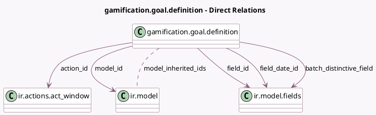

<!-- GENERATED:MODEL -->
---
tags: [odoo, community, generated, model]
---

# gamification.goal.definition

- Module: [[docs/Community Addons/gamification/gamification|gamification]]
- Scope: Community Addons
- Defined in module: yes
- Source files: `models/gamification_goal_definition.py`
- Python classes: `GamificationGoalDefinition`
- Description: Gamification Goal Definition

## Field footprint

- Detected fields: 19
- Field types: `Boolean` x 2, `Char` x 6, `Many2many` x 1, `Many2one` x 5, `Selection` x 3, `Text` x 2
- Relation fields: 6

## Sample fields

- `action_id`: `Many2one` (comodel `ir.actions.act_window`)
- `batch_distinctive_field`: `Many2one` (comodel `ir.model.fields`)
- `batch_mode`: `Boolean` (comodel `Batch Mode`)
- `batch_user_expression`: `Char` (comodel `Evaluated expression for batch mode`)
- `computation_mode`: `Selection`
- `compute_code`: `Text` (comodel `Python Code`)
- `condition`: `Selection`
- `description`: `Text` (comodel `Goal Description`)
- `display_mode`: `Selection`
- `domain`: `Char` (comodel `Filter Domain`)
- `field_date_id`: `Many2one` (comodel `ir.model.fields`)
- `field_id`: `Many2one` (comodel `ir.model.fields`)
- `full_suffix`: `Char` (comodel `Full Suffix`, compute `_compute_full_suffix`)
- `model_id`: `Many2one` (comodel `ir.model`)
- `model_inherited_ids`: `Many2many` (comodel `ir.model`, related `model_id.inherited_model_ids`)
- `monetary`: `Boolean` (comodel `Monetary Value`)
- `name`: `Char` (comodel `Goal Definition`)
- `res_id_field`: `Char` (comodel `ID Field of user`)
- `suffix`: `Char` (comodel `Suffix`)

## Method hints

- Detected methods: 5
- Action methods: none
- Compute methods: `_compute_full_suffix`
- Onchange methods: none

## Direct relation diagram

## Navigation

- **Parent:** [[docs/Community Addons/gamification/Models]]

<!-- GENERATED:MODEL -->
