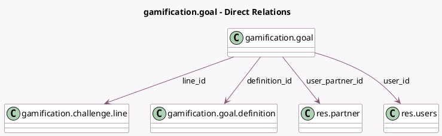

<!-- GENERATED:MODEL -->
---
tags: [odoo, community, generated, model]
---

# gamification.goal

- Module: [[docs/Community Addons/gamification/gamification|gamification]]
- Scope: Community Addons
- Defined in module: yes
- Source files: `models/gamification_goal.py`
- Python classes: `GamificationGoal`
- Description: Gamification Goal

## Field footprint

- Detected fields: 21
- Field types: `Boolean` x 2, `Char` x 1, `Date` x 3, `Float` x 3, `Integer` x 2, `Many2one` x 5, `Selection` x 4, `Text` x 1
- Relation fields: 5

## Sample fields

- `challenge_id`: `Many2one` (related `line_id.challenge_id`, store `True`)
- `closed`: `Boolean` (comodel `Closed goal`)
- `color`: `Integer` (comodel `Color Index`, compute `_compute_color`)
- `completeness`: `Float` (comodel `Completeness`, compute `_get_completion`)
- `computation_mode`: `Selection` (related `definition_id.computation_mode`)
- `current`: `Float` (comodel `Current Value`)
- `definition_condition`: `Selection` (related `definition_id.condition`)
- `definition_description`: `Text` (comodel `Definition Description`, related `definition_id.description`)
- `definition_display`: `Selection` (related `definition_id.display_mode`)
- `definition_id`: `Many2one` (comodel `gamification.goal.definition`)
- `definition_suffix`: `Char` (comodel `Suffix`, related `definition_id.full_suffix`)
- `end_date`: `Date` (comodel `End Date`)
- `last_update`: `Date` (comodel `Last Update`)
- `line_id`: `Many2one` (comodel `gamification.challenge.line`)
- `remind_update_delay`: `Integer` (comodel `Remind delay`)
- `start_date`: `Date` (comodel `Start Date`)
- `state`: `Selection`
- `target_goal`: `Float` (comodel `To Reach`)
- `to_update`: `Boolean` (comodel `To update`)
- `user_id`: `Many2one` (comodel `res.users`)

## Method hints

- Detected methods: 13
- Action methods: `action_cancel`, `action_fail`, `action_reach`, `action_start`
- Compute methods: `_compute_color`
- Onchange methods: none

## Direct relation diagram

## Navigation

- **Parent:** [[docs/Community Addons/gamification/Models]]

<!-- GENERATED:MODEL -->
