<!-- GENERATED:MODEL -->
---
tags: [odoo, community, generated, model]
---

# gamification.karma.rank

- Module: [[docs/Community Addons/gamification/gamification|gamification]]
- Scope: Community Addons
- Defined in module: yes
- Source files: `models/gamification_karma_rank.py`
- Python classes: `GamificationKarmaRank`
- Description: Rank based on karma
- Inherits: `image.mixin`

## Field footprint

- Detected fields: 6
- Field types: `Html` x 2, `Integer` x 2, `One2many` x 1, `Text` x 1
- Relation fields: 1

## Sample fields

- `description`: `Html`
- `description_motivational`: `Html`
- `karma_min`: `Integer`
- `name`: `Text`
- `rank_users_count`: `Integer` (comodel `# Users`, compute `_compute_rank_users_count`)
- `user_ids`: `One2many` (comodel `res.users`)

## Method hints

- Detected methods: 3
- Action methods: none
- Compute methods: `_compute_rank_users_count`
- Onchange methods: none

## Direct relation diagram

```plantuml
@startuml
!define ODOO_COLOR_PRIMARY #714B67
!define ODOO_COLOR_ACCENT #875A7B
!define ODOO_COLOR_BG #FAF7FA

skinparam backgroundColor ODOO_COLOR_BG
skinparam defaultTextAlignment left
skinparam ArrowColor ODOO_COLOR_ACCENT
skinparam ClassBackgroundColor white
skinparam ClassBorderColor ODOO_COLOR_PRIMARY
skinparam ComponentBackgroundColor white
skinparam ComponentBorderColor ODOO_COLOR_PRIMARY
skinparam NoteBackgroundColor #FFF8FF
skinparam NoteBorderColor ODOO_COLOR_ACCENT
skinparam SequenceLifeLineBorderColor ODOO_COLOR_ACCENT
skinparam SequenceLifeLineBackgroundColor #FFFFFF
skinparam SequenceParticipantBorderColor ODOO_COLOR_PRIMARY
skinparam SequenceParticipantBackgroundColor #FFFFFF
skinparam sequence {
  ArrowColor ODOO_COLOR_ACCENT
  ActorBorderColor ODOO_COLOR_PRIMARY
}
title gamification.karma.rank - Direct Relations
class "gamification.karma.rank" as gamification_karma_rank
class "res.users" as res_users
gamification_karma_rank --|> res_users : user_ids
@enduml
```

## Navigation

- **Parent:** [[docs/Community Addons/gamification/Models]]

<!-- GENERATED:MODEL -->
