<!-- GENERATED:MODEL -->
---
tags: [odoo, community, generated, model]
---

# gamification.karma.tracking

- Module: [[docs/Community Addons/gamification/gamification|gamification]]
- Scope: Community Addons
- Defined in module: yes
- Source files: `models/gamification_karma_tracking.py`
- Python classes: `GamificationKarmaTracking`
- Description: Track Karma Changes

## Field footprint

- Detected fields: 9
- Field types: `Boolean` x 1, `Datetime` x 1, `Integer` x 3, `Many2one` x 1, `Reference` x 1, `Selection` x 1, `Text` x 1
- Relation fields: 1

## Sample fields

- `consolidated`: `Boolean` (comodel `Consolidated`)
- `gain`: `Integer` (comodel `Gain`, compute `_compute_gain`)
- `new_value`: `Integer` (comodel `New Karma Value`)
- `old_value`: `Integer` (comodel `Old Karma Value`)
- `origin_ref`: `Reference`
- `origin_ref_model_name`: `Selection` (compute `_compute_origin_ref_model_name`, store `True`)
- `reason`: `Text`
- `tracking_date`: `Datetime`
- `user_id`: `Many2one` (comodel `res.users`)

## Method hints

- Detected methods: 6
- Action methods: none
- Compute methods: `_compute_gain`, `_compute_origin_ref_model_name`
- Onchange methods: none

## Direct relation diagram

```plantuml
@startuml
!define ODOO_COLOR_PRIMARY #714B67
!define ODOO_COLOR_ACCENT #875A7B
!define ODOO_COLOR_BG #FAF7FA

skinparam backgroundColor ODOO_COLOR_BG
skinparam defaultTextAlignment left
skinparam ArrowColor ODOO_COLOR_ACCENT
skinparam ClassBackgroundColor white
skinparam ClassBorderColor ODOO_COLOR_PRIMARY
skinparam ComponentBackgroundColor white
skinparam ComponentBorderColor ODOO_COLOR_PRIMARY
skinparam NoteBackgroundColor #FFF8FF
skinparam NoteBorderColor ODOO_COLOR_ACCENT
skinparam SequenceLifeLineBorderColor ODOO_COLOR_ACCENT
skinparam SequenceLifeLineBackgroundColor #FFFFFF
skinparam SequenceParticipantBorderColor ODOO_COLOR_PRIMARY
skinparam SequenceParticipantBackgroundColor #FFFFFF
skinparam sequence {
  ArrowColor ODOO_COLOR_ACCENT
  ActorBorderColor ODOO_COLOR_PRIMARY
}
title gamification.karma.tracking - Direct Relations
class "gamification.karma.tracking" as gamification_karma_tracking
class "res.users" as res_users
gamification_karma_tracking --> res_users : user_id
@enduml
```

## Navigation

- **Parent:** [[docs/Community Addons/gamification/Models]]

<!-- GENERATED:MODEL -->
