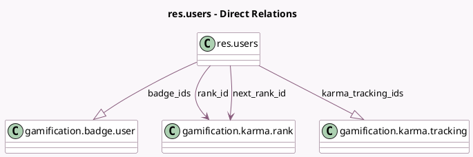

<!-- GENERATED:MODEL -->
---
tags: [odoo, community, generated, model]
---

# res.users

- Module: [[docs/Community Addons/gamification/gamification|gamification]]
- Scope: Community Addons
- Defined in module: extension only
- Source files: `models/res_users.py`
- Python classes: `ResUsers`

## Field footprint

- Detected fields: 8
- Field types: `Integer` x 4, `Many2one` x 2, `One2many` x 2
- Relation fields: 4

## Sample fields

- `badge_ids`: `One2many` (comodel `gamification.badge.user`)
- `bronze_badge`: `Integer` (comodel `Bronze badges count`, compute `_get_user_badge_level`)
- `gold_badge`: `Integer` (comodel `Gold badges count`, compute `_get_user_badge_level`)
- `karma`: `Integer` (comodel `Karma`, compute `_compute_karma`, store `True`)
- `karma_tracking_ids`: `One2many` (comodel `gamification.karma.tracking`)
- `next_rank_id`: `Many2one` (comodel `gamification.karma.rank`)
- `rank_id`: `Many2one` (comodel `gamification.karma.rank`)
- `silver_badge`: `Integer` (comodel `Silver badges count`, compute `_get_user_badge_level`)

## Method hints

- Detected methods: 14
- Action methods: `action_karma_report`
- Compute methods: `_compute_karma`
- Onchange methods: none

## Direct relation diagram

## Navigation

- **Parent:** [[docs/Community Addons/gamification/Models]]

<!-- GENERATED:MODEL -->
