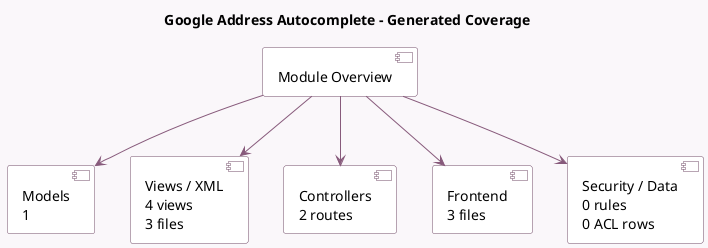

<!-- GENERATED:MODULE -->
---
tags: [odoo, community, module]
---

# Google Address Autocomplete

- Scope: Community Addons
- Source: odoo/addons/google_address_autocomplete
- Dependencies: [[docs/Community Addons/web/web|web]]

## Summary

Assist with automatic completion & suggestions when filling address

## Generated coverage

- Models: 1
- XML files with UI/data artifacts: 3
- Views: 4
- Actions: 0
- Menus: 0
- Rules (ir.rule): 0
- Access CSV entries: 0
- Controller units: 1
- Frontend asset files: 3

## Module map

## Detail notes

- Models: [[docs/Community Addons/google_address_autocomplete/Models|Models]] (1)
- Views and XML: [[docs/Community Addons/google_address_autocomplete/Views|Views]] (3 files)
- Controllers: [[docs/Community Addons/google_address_autocomplete/Controllers|Controllers]] (1)
- Frontend: [[docs/Community Addons/google_address_autocomplete/Frontend|Frontend]] (3 files)

## Key models

- `res.config.settings`

## Navigation

- [[../Community Addons/Community Addons|Back to scope]]
- [[../../docs/docs|Back to docs]]

<!-- GENERATED:MODULE -->

