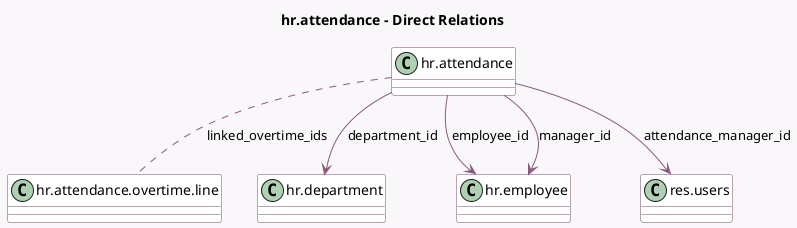

<!-- GENERATED:MODEL -->
---
tags: [odoo, community, generated, model]
---

# hr.attendance

- Module: [[docs/Community Addons/hr_attendance/hr_attendance|hr_attendance]]
- Scope: Community Addons
- Defined in module: yes
- Source files: `models/hr_attendance.py`
- Python classes: `HrAttendance`
- Description: Attendance
- Inherits: `mail.thread`

## Field footprint

- Detected fields: 28
- Field types: `Boolean` x 2, `Char` x 6, `Date` x 1, `Datetime` x 2, `Float` x 8, `Integer` x 1, `Many2many` x 1, `Many2one` x 4, `Selection` x 3
- Relation fields: 5

## Sample fields

- `attendance_manager_id`: `Many2one` (comodel `res.users`, related `employee_id.attendance_manager_id`)
- `check_in`: `Datetime`
- `check_out`: `Datetime`
- `color`: `Integer` (compute `_compute_color`)
- `date`: `Date` (compute `_compute_date`, store `True`)
- `department_id`: `Many2one` (comodel `hr.department`, related `employee_id.department_id`)
- `device_tracking_enabled`: `Boolean` (related `employee_id.company_id.attendance_device_tracking`)
- `employee_id`: `Many2one` (comodel `hr.employee`)
- `expected_hours`: `Float` (compute `_compute_expected_hours`, store `True`)
- `in_browser`: `Char`
- `in_ip_address`: `Char`
- `in_latitude`: `Float`
- `in_location`: `Char`
- `in_longitude`: `Float`
- `in_mode`: `Selection`
- `is_manager`: `Boolean` (compute `_compute_is_manager`)
- `linked_overtime_ids`: `Many2many` (comodel `hr.attendance.overtime.line`, compute `_compute_linked_overtime_ids`)
- `manager_id`: `Many2one` (comodel `hr.employee`, related `employee_id.parent_id`)
- `out_browser`: `Char`
- `out_ip_address`: `Char`

## Method hints

- Detected methods: 34
- Action methods: `action_approve_overtime`, `action_in_attendance_maps`, `action_out_attendance_maps`, `action_refuse_overtime`, `action_try_kiosk`
- Compute methods: `_compute_color`, `_compute_date`, `_compute_display_name`, `_compute_expected_hours`, `_compute_is_manager`, `_compute_linked_overtime_ids`, `_compute_overtime_hours`, `_compute_overtime_status`, and 2 more
- Onchange methods: none

## Direct relation diagram

## Navigation

- **Parent:** [[docs/Community Addons/hr_attendance/Models]]

<!-- GENERATED:MODEL -->
