<!-- GENERATED:MODEL -->
---
tags: [odoo, community, generated, model]
---

# hr.attendance.overtime.line

- Module: [[docs/Community Addons/hr_attendance/hr_attendance|hr_attendance]]
- Scope: Community Addons
- Defined in module: yes
- Source files: `models/hr_attendance_overtime.py`
- Python classes: `HrAttendanceOvertimeLine`
- Description: Attendance Overtime Line

## Field footprint

- Detected fields: 11
- Field types: `Boolean` x 1, `Date` x 1, `Datetime` x 2, `Float` x 3, `Many2many` x 1, `Many2one` x 2, `Selection` x 1
- Relation fields: 3

## Sample fields

- `amount_rate`: `Float` (comodel `Overtime pay rate`)
- `company_id`: `Many2one` (related `employee_id.company_id`)
- `date`: `Date`
- `duration`: `Float`
- `employee_id`: `Many2one` (comodel `hr.employee`)
- `is_manager`: `Boolean` (compute `_compute_is_manager`)
- `manual_duration`: `Float` (compute `_compute_manual_duration`, store `True`)
- `rule_ids`: `Many2many` (comodel `hr.attendance.overtime.rule`)
- `status`: `Selection` (compute `_compute_status`, store `True`)
- `time_start`: `Datetime`
- `time_stop`: `Datetime`

## Method hints

- Detected methods: 7
- Action methods: `action_approve`, `action_refuse`
- Compute methods: `_compute_is_manager`, `_compute_manual_duration`, `_compute_status`
- Onchange methods: none

## Direct relation diagram

```plantuml
@startuml
!define ODOO_COLOR_PRIMARY #714B67
!define ODOO_COLOR_ACCENT #875A7B
!define ODOO_COLOR_BG #FAF7FA

skinparam backgroundColor ODOO_COLOR_BG
skinparam defaultTextAlignment left
skinparam ArrowColor ODOO_COLOR_ACCENT
skinparam ClassBackgroundColor white
skinparam ClassBorderColor ODOO_COLOR_PRIMARY
skinparam ComponentBackgroundColor white
skinparam ComponentBorderColor ODOO_COLOR_PRIMARY
skinparam NoteBackgroundColor #FFF8FF
skinparam NoteBorderColor ODOO_COLOR_ACCENT
skinparam SequenceLifeLineBorderColor ODOO_COLOR_ACCENT
skinparam SequenceLifeLineBackgroundColor #FFFFFF
skinparam SequenceParticipantBorderColor ODOO_COLOR_PRIMARY
skinparam SequenceParticipantBackgroundColor #FFFFFF
skinparam sequence {
  ArrowColor ODOO_COLOR_ACCENT
  ActorBorderColor ODOO_COLOR_PRIMARY
}
title hr.attendance.overtime.line - Direct Relations
class "hr.attendance.overtime.line" as hr_attendance_overtime_line
class "hr.attendance.overtime.rule" as hr_attendance_overtime_rule
class "hr.employee" as hr_employee
hr_attendance_overtime_line --> hr_employee : employee_id
hr_attendance_overtime_line .. hr_attendance_overtime_rule : rule_ids
@enduml
```

## Navigation

- **Parent:** [[docs/Community Addons/hr_attendance/Models]]

<!-- GENERATED:MODEL -->
