<!-- GENERATED:MODEL -->
---
tags: [odoo, community, generated, model]
---

# hr.attendance.overtime.rule

- Module: [[docs/Community Addons/hr_attendance/hr_attendance|hr_attendance]]
- Scope: Community Addons
- Defined in module: yes
- Source files: `models/hr_attendance_overtime_rule.py`
- Python classes: `HrAttendanceOvertimeRule`
- Description: Overtime Rule

## Field footprint

- Detected fields: 18
- Field types: `Boolean` x 2, `Char` x 2, `Float` x 6, `Html` x 1, `Integer` x 1, `Many2one` x 3, `Selection` x 3
- Relation fields: 3

## Sample fields

- `amount_rate`: `Float` (comodel `Rate`)
- `base_off`: `Selection`
- `company_id`: `Many2one` (related `ruleset_id.company_id`)
- `description`: `Html`
- `employee_tolerance`: `Float`
- `employer_tolerance`: `Float`
- `expected_hours`: `Float`
- `expected_hours_from_contract`: `Boolean` (comodel `Hours from employee schedule`)
- `information_display`: `Char` (comodel `Information`, compute `_compute_information_display`)
- `name`: `Char`
- `paid`: `Boolean` (comodel `Pay Extra Hours`)
- `quantity_period`: `Selection`
- `resource_calendar_id`: `Many2one` (comodel `resource.calendar`)
- `ruleset_id`: `Many2one` (comodel `hr.attendance.overtime.ruleset`)
- `sequence`: `Integer`
- `timing_start`: `Float` (comodel `From`)
- `timing_stop`: `Float` (comodel `To`)
- `timing_type`: `Selection`

## Method hints

- Detected methods: 12
- Action methods: none
- Compute methods: `_compute_information_display`
- Onchange methods: none

## Direct relation diagram

```plantuml
@startuml
!define ODOO_COLOR_PRIMARY #714B67
!define ODOO_COLOR_ACCENT #875A7B
!define ODOO_COLOR_BG #FAF7FA

skinparam backgroundColor ODOO_COLOR_BG
skinparam defaultTextAlignment left
skinparam ArrowColor ODOO_COLOR_ACCENT
skinparam ClassBackgroundColor white
skinparam ClassBorderColor ODOO_COLOR_PRIMARY
skinparam ComponentBackgroundColor white
skinparam ComponentBorderColor ODOO_COLOR_PRIMARY
skinparam NoteBackgroundColor #FFF8FF
skinparam NoteBorderColor ODOO_COLOR_ACCENT
skinparam SequenceLifeLineBorderColor ODOO_COLOR_ACCENT
skinparam SequenceLifeLineBackgroundColor #FFFFFF
skinparam SequenceParticipantBorderColor ODOO_COLOR_PRIMARY
skinparam SequenceParticipantBackgroundColor #FFFFFF
skinparam sequence {
  ArrowColor ODOO_COLOR_ACCENT
  ActorBorderColor ODOO_COLOR_PRIMARY
}
title hr.attendance.overtime.rule - Direct Relations
class "hr.attendance.overtime.rule" as hr_attendance_overtime_rule
class "hr.attendance.overtime.ruleset" as hr_attendance_overtime_ruleset
class "resource.calendar" as resource_calendar
hr_attendance_overtime_rule --> resource_calendar : resource_calendar_id
hr_attendance_overtime_rule --> hr_attendance_overtime_ruleset : ruleset_id
@enduml
```

## Navigation

- **Parent:** [[docs/Community Addons/hr_attendance/Models]]

<!-- GENERATED:MODEL -->
