<!-- GENERATED:MODEL -->
---
tags: [odoo, community, generated, model]
---

# hr.attendance.overtime.ruleset

- Module: [[docs/Community Addons/hr_attendance/hr_attendance|hr_attendance]]
- Scope: Community Addons
- Defined in module: yes
- Source files: `models/hr_attendance_overtime_ruleset.py`
- Python classes: `HrAttendanceOvertimeRuleset`
- Description: Overtime Ruleset

## Field footprint

- Detected fields: 8
- Field types: `Boolean` x 1, `Char` x 1, `Html` x 1, `Integer` x 1, `Many2one` x 2, `One2many` x 1, `Selection` x 1
- Relation fields: 3

## Sample fields

- `active`: `Boolean`
- `company_id`: `Many2one` (comodel `res.company`)
- `country_id`: `Many2one` (comodel `res.country`)
- `description`: `Html`
- `name`: `Char`
- `rate_combination_mode`: `Selection`
- `rule_ids`: `One2many` (comodel `hr.attendance.overtime.rule`)
- `rules_count`: `Integer` (compute `_compute_rules_count`)

## Method hints

- Detected methods: 3
- Action methods: `action_regenerate_overtimes`
- Compute methods: `_compute_rules_count`
- Onchange methods: none

## Direct relation diagram

```plantuml
@startuml
!define ODOO_COLOR_PRIMARY #714B67
!define ODOO_COLOR_ACCENT #875A7B
!define ODOO_COLOR_BG #FAF7FA

skinparam backgroundColor ODOO_COLOR_BG
skinparam defaultTextAlignment left
skinparam ArrowColor ODOO_COLOR_ACCENT
skinparam ClassBackgroundColor white
skinparam ClassBorderColor ODOO_COLOR_PRIMARY
skinparam ComponentBackgroundColor white
skinparam ComponentBorderColor ODOO_COLOR_PRIMARY
skinparam NoteBackgroundColor #FFF8FF
skinparam NoteBorderColor ODOO_COLOR_ACCENT
skinparam SequenceLifeLineBorderColor ODOO_COLOR_ACCENT
skinparam SequenceLifeLineBackgroundColor #FFFFFF
skinparam SequenceParticipantBorderColor ODOO_COLOR_PRIMARY
skinparam SequenceParticipantBackgroundColor #FFFFFF
skinparam sequence {
  ArrowColor ODOO_COLOR_ACCENT
  ActorBorderColor ODOO_COLOR_PRIMARY
}
title hr.attendance.overtime.ruleset - Direct Relations
class "hr.attendance.overtime.ruleset" as hr_attendance_overtime_ruleset
class "hr.attendance.overtime.rule" as hr_attendance_overtime_rule
class "res.company" as res_company
class "res.country" as res_country
hr_attendance_overtime_ruleset --|> hr_attendance_overtime_rule : rule_ids
hr_attendance_overtime_ruleset --> res_company : company_id
hr_attendance_overtime_ruleset --> res_country : country_id
@enduml
```

## Navigation

- **Parent:** [[docs/Community Addons/hr_attendance/Models]]

<!-- GENERATED:MODEL -->
