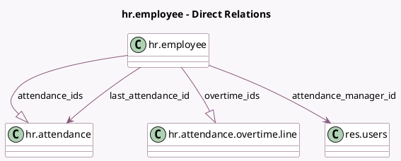

<!-- GENERATED:MODEL -->
---
tags: [odoo, community, generated, model]
---

# hr.employee

- Module: [[docs/Community Addons/hr_attendance/hr_attendance|hr_attendance]]
- Scope: Community Addons
- Defined in module: extension only
- Source files: `models/hr_employee.py`
- Python classes: `HrEmployee`

## Field footprint

- Detected fields: 16
- Field types: `Boolean` x 1, `Char` x 1, `Datetime` x 2, `Float` x 6, `Many2one` x 3, `One2many` x 2, `Selection` x 1
- Relation fields: 5

## Sample fields

- `attendance_ids`: `One2many` (comodel `hr.attendance`)
- `attendance_manager_id`: `Many2one` (comodel `res.users`, store `True`)
- `attendance_state`: `Selection` (compute `_compute_attendance_state`)
- `display_extra_hours`: `Boolean` (related `company_id.hr_attendance_display_overtime`)
- `hours_last_month`: `Float` (compute `_compute_hours_last_month`)
- `hours_last_month_display`: `Char` (compute `_compute_hours_last_month`)
- `hours_last_month_overtime`: `Float` (compute `_compute_hours_last_month`)
- `hours_previously_today`: `Float` (compute `_compute_hours_today`)
- `hours_today`: `Float` (compute `_compute_hours_today`)
- `last_attendance_id`: `Many2one` (comodel `hr.attendance`, compute `_compute_last_attendance_id`, store `True`)
- `last_attendance_worked_hours`: `Float` (compute `_compute_hours_today`)
- `last_check_in`: `Datetime` (related `last_attendance_id.check_in`, store `True`)
- `last_check_out`: `Datetime` (related `last_attendance_id.check_out`, store `True`)
- `overtime_ids`: `One2many` (comodel `hr.attendance.overtime.line`)
- `ruleset_id`: `Many2one` (related `version_id.ruleset_id`)
- `total_overtime`: `Float` (compute `_compute_total_overtime`)

## Method hints

- Detected methods: 13
- Action methods: `action_open_last_month_attendances`
- Compute methods: `_compute_attendance_state`, `_compute_hours_last_month`, `_compute_hours_today`, `_compute_last_attendance_id`, `_compute_presence_icon`, `_compute_presence_state`, `_compute_total_overtime`
- Onchange methods: none

## Direct relation diagram

## Navigation

- **Parent:** [[docs/Community Addons/hr_attendance/Models]]

<!-- GENERATED:MODEL -->
