<!-- GENERATED:MODEL -->
---
tags: [odoo, community, generated, model]
---

# hr.employee.public

- Module: [[docs/Community Addons/hr_attendance/hr_attendance|hr_attendance]]
- Scope: Community Addons
- Defined in module: extension only
- Source files: `models/hr_employee_public.py`
- Python classes: `HrEmployeePublic`

## Field footprint

- Detected fields: 10
- Field types: `Boolean` x 1, `Datetime` x 2, `Float` x 4, `Many2one` x 2, `Selection` x 1
- Relation fields: 2

## Sample fields

- `attendance_manager_id`: `Many2one` (related `employee_id.attendance_manager_id`)
- `attendance_state`: `Selection` (related `employee_id.attendance_state`)
- `display_extra_hours`: `Boolean` (related `company_id.hr_attendance_display_overtime`)
- `hours_last_month`: `Float` (related `employee_id.hours_last_month`)
- `hours_last_month_overtime`: `Float` (related `employee_id.hours_last_month_overtime`)
- `hours_today`: `Float` (related `employee_id.hours_today`)
- `last_attendance_id`: `Many2one` (related `employee_id.last_attendance_id`)
- `last_check_in`: `Datetime` (related `employee_id.last_check_in`)
- `last_check_out`: `Datetime` (related `employee_id.last_check_out`)
- `total_overtime`: `Float` (related `employee_id.total_overtime`)

## Method hints

- Detected methods: 1
- Action methods: `action_open_last_month_attendances`
- Compute methods: none
- Onchange methods: none

## Direct relation diagram

```plantuml
@startuml
!define ODOO_COLOR_PRIMARY #714B67
!define ODOO_COLOR_ACCENT #875A7B
!define ODOO_COLOR_BG #FAF7FA

skinparam backgroundColor ODOO_COLOR_BG
skinparam defaultTextAlignment left
skinparam ArrowColor ODOO_COLOR_ACCENT
skinparam ClassBackgroundColor white
skinparam ClassBorderColor ODOO_COLOR_PRIMARY
skinparam ComponentBackgroundColor white
skinparam ComponentBorderColor ODOO_COLOR_PRIMARY
skinparam NoteBackgroundColor #FFF8FF
skinparam NoteBorderColor ODOO_COLOR_ACCENT
skinparam SequenceLifeLineBorderColor ODOO_COLOR_ACCENT
skinparam SequenceLifeLineBackgroundColor #FFFFFF
skinparam SequenceParticipantBorderColor ODOO_COLOR_PRIMARY
skinparam SequenceParticipantBackgroundColor #FFFFFF
skinparam sequence {
  ArrowColor ODOO_COLOR_ACCENT
  ActorBorderColor ODOO_COLOR_PRIMARY
}
title hr.employee.public - Direct Relations
class "hr.employee.public" as hr_employee_public
@enduml
```

## Navigation

- **Parent:** [[docs/Community Addons/hr_attendance/Models]]

<!-- GENERATED:MODEL -->
