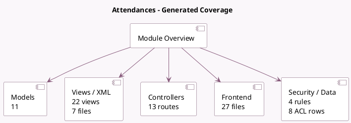

<!-- GENERATED:MODULE -->
---
tags: [odoo, community, module]
---

# Attendances

- Scope: Community Addons
- Source: odoo/addons/hr_attendance
- Dependencies: [[docs/Community Addons/hr/hr|hr]], [[docs/Community Addons/barcodes/barcodes|barcodes]], [[docs/Community Addons/base_geolocalize/base_geolocalize|base_geolocalize]]

## Summary

Track employee attendance

## Generated coverage

- Models: 11
- XML files with UI/data artifacts: 7
- Views: 22
- Actions: 11
- Menus: 12
- Rules (ir.rule): 4
- Access CSV entries: 8
- Controller units: 1
- Frontend asset files: 27

## Module map

## Detail notes

- Models: [[docs/Community Addons/hr_attendance/Models|Models]] (11)
- Views and XML: [[docs/Community Addons/hr_attendance/Views|Views]] (7 files)
- Controllers: [[docs/Community Addons/hr_attendance/Controllers|Controllers]] (1)
- Frontend: [[docs/Community Addons/hr_attendance/Frontend|Frontend]] (27 files)

## Key models

- `hr.attendance`
- `hr.attendance.overtime.line`
- `hr.attendance.overtime.rule`
- `hr.attendance.overtime.ruleset`
- `hr.employee`
- `hr.employee.public`
- `hr.version`
- `ir.http`
- `res.company`
- `res.config.settings`
- `res.users`

## Navigation

- [[../Community Addons/Community Addons|Back to scope]]
- [[../../docs/docs|Back to docs]]

<!-- GENERATED:MODULE -->

## Curated analysis

### Functional role
- `hr_attendance` covers employee check-in and check-out, but in practice it is also the kiosk entry point, a barcode-enabled device flow, and the base for overtime computation.
- The overtime models and rulesets turn raw punches into policy-aware attendance outcomes that HR managers can audit and correct.

### Operational footprint
- `hr_attendance.py` and the overtime model files drive employee state, worked hours, extra-hours logic, and auto-check-out behavior.
- The public kiosk flow is exposed through `controllers/main.py`, while `data/hr_attendance_data.xml` schedules automatic check-out and absence handling.

### Evidence
- Source files: `odoo19/addons/hr_attendance/models/hr_attendance.py`, `odoo19/addons/hr_attendance/models/hr_attendance_overtime_rule.py`, `odoo19/addons/hr_attendance/models/hr_attendance_overtime_ruleset.py`
- UI, security, and automation: `odoo19/addons/hr_attendance/views/hr_attendance_view.xml`, `odoo19/addons/hr_attendance/security/hr_attendance_security.xml`, `odoo19/addons/hr_attendance/data/hr_attendance_data.xml`
- Tests: `odoo19/addons/hr_attendance/tests/test_hr_attendance_process.py`, `odoo19/addons/hr_attendance/tests/test_hr_attendance_overtime.py`, `odoo19/addons/hr_attendance/tests/test_hr_attendance_kiosk.py`

### Related notes
- `[[docs/Community Addons/hr/hr|hr]]`
- `[[docs/Core/Infrastructure/Security]]`

### Risks and follow-up
- Timezone handling, kiosk devices, and overtime thresholds are the failure hotspots; they need to be validated together, not in isolation.
- Shared or public kiosks require extra care around user identification, barcode devices, and access groups because the module exposes both HR and operational data.
- Legacy comparison backlog was retired on 2026-03-02; keep this note focused on the current codebase.

