<!-- GENERATED:MODEL -->
---
tags: [odoo, community, generated, model]
---

# hr.expense

- Module: [[docs/Community Addons/hr_expense/hr_expense|hr_expense]]
- Scope: Community Addons
- Defined in module: yes
- Source files: `models/hr_expense.py`
- Python classes: `HrExpense`
- Description: Expense
- Inherits: `analytic.mixin`, `mail.activity.mixin`, `mail.thread.main.attachment`

## Field footprint

- Detected fields: 47
- Field types: `Boolean` x 6, `Char` x 3, `Date` x 1, `Datetime` x 1, `Float` x 3, `Html` x 1, `Integer` x 2, `Many2many` x 4, `Many2one` x 14, `Monetary` x 7, `One2many` x 1, `Selection` x 3, `Text` x 1
- Relation fields: 19

## Sample fields

- `account_id`: `Many2one` (comodel `account.account`, compute `_compute_account_id`, store `True`)
- `account_move_id`: `Many2one` (comodel `account.move`)
- `amount_residual`: `Monetary` (related `account_move_id.amount_residual`)
- `approval_date`: `Datetime`
- `approval_state`: `Selection`
- `attachment_ids`: `One2many` (comodel `ir.attachment`)
- `can_approve`: `Boolean` (compute `_compute_can_approve`)
- `can_reset`: `Boolean` (compute `_compute_can_reset`)
- `company_currency_id`: `Many2one` (comodel `res.currency`, related `company_id.currency_id`)
- `company_id`: `Many2one` (comodel `res.company`)
- `currency_id`: `Many2one` (comodel `res.currency`, compute `_compute_currency_id`, store `True`)
- `currency_rate`: `Float` (compute `_compute_currency_rate`)
- `date`: `Date`
- `department_id`: `Many2one` (comodel `hr.department`, compute `_compute_from_employee_id`, store `True`)
- `description`: `Text`
- `duplicate_expense_ids`: `Many2many` (comodel `hr.expense`, compute `_compute_duplicate_expense_ids`)
- `employee_id`: `Many2one` (comodel `hr.employee`, compute `_compute_employee_id`, store `True`)
- `former_sheet_id`: `Integer`
- `is_editable`: `Boolean` (compute `_compute_is_editable`)
- `is_multiple_currency`: `Boolean` (compute `_compute_is_multiple_currency`)

## Method hints

- Detected methods: 87
- Action methods: `action_approve`, `action_approve_duplicates`, `action_get_attachment_view`, `action_open_account_move`, `action_open_split_expense`, `action_pay`, `action_post`, `action_refuse`, and 4 more
- Compute methods: `_compute_account_id`, `_compute_analytic_distribution`, `_compute_can_approve`, `_compute_can_reset`, `_compute_currency_id`, `_compute_currency_rate`, `_compute_duplicate_expense_ids`, `_compute_employee_id`, and 18 more
- Onchange methods: `_inverse_total_amount_currency`, `_onchange_product_has_cost`

## Direct relation diagram

```plantuml
@startuml
!define ODOO_COLOR_PRIMARY #714B67
!define ODOO_COLOR_ACCENT #875A7B
!define ODOO_COLOR_BG #FAF7FA

skinparam backgroundColor ODOO_COLOR_BG
skinparam defaultTextAlignment left
skinparam ArrowColor ODOO_COLOR_ACCENT
skinparam ClassBackgroundColor white
skinparam ClassBorderColor ODOO_COLOR_PRIMARY
skinparam ComponentBackgroundColor white
skinparam ComponentBorderColor ODOO_COLOR_PRIMARY
skinparam NoteBackgroundColor #FFF8FF
skinparam NoteBorderColor ODOO_COLOR_ACCENT
skinparam SequenceLifeLineBorderColor ODOO_COLOR_ACCENT
skinparam SequenceLifeLineBackgroundColor #FFFFFF
skinparam SequenceParticipantBorderColor ODOO_COLOR_PRIMARY
skinparam SequenceParticipantBackgroundColor #FFFFFF
skinparam sequence {
  ArrowColor ODOO_COLOR_ACCENT
  ActorBorderColor ODOO_COLOR_PRIMARY
}
title hr.expense - Direct Relations
class "hr.expense" as hr_expense
class "account.account" as account_account
class "account.journal" as account_journal
class "account.move" as account_move
class "account.payment.method.line" as account_payment_method_line
class "account.tax" as account_tax
class "hr.department" as hr_department
class "hr.employee" as hr_employee
class "hr.expense" as hr_expense
class "ir.attachment" as ir_attachment
class "product.product" as product_product
class "res.company" as res_company
class "res.currency" as res_currency
hr_expense --> hr_employee : employee_id
hr_expense --> hr_department : department_id
hr_expense --> res_users : manager_id
hr_expense --> res_company : company_id
hr_expense --> product_product : product_id
hr_expense --> uom_uom : product_uom_id
hr_expense --|> ir_attachment : attachment_ids
hr_expense .. hr_expense : duplicate_expense_ids
hr_expense .. hr_expense : same_receipt_expense_ids
hr_expense --> hr_expense : split_expense_origin_id
hr_expense --> res_currency : currency_id
hr_expense --> res_currency : company_currency_id
hr_expense --> account_journal : journal_id
hr_expense .. account_payment_method_line : selectable_payment_method_line_ids
hr_expense --> account_payment_method_line : payment_method_line_id
hr_expense --> account_move : account_move_id
hr_expense --> res_partner : vendor_id
hr_expense --> account_account : account_id
@enduml
```

## Navigation

- **Parent:** [[docs/Community Addons/hr_expense/Models]]

<!-- GENERATED:MODEL -->
