<!-- GENERATED:MODEL -->
---
tags: [odoo, community, generated, model]
---

# hr.expense.post.wizard

- Module: [[docs/Community Addons/hr_expense/hr_expense|hr_expense]]
- Scope: Community Addons
- Defined in module: yes
- Source files: `wizard/hr_expense_post_wizard.py`
- Python classes: `HrExpensePostWizard`
- Description: Expense Posting Wizard

## Field footprint

- Detected fields: 3
- Field types: `Date` x 1, `Many2one` x 2
- Relation fields: 2

## Sample fields

- `accounting_date`: `Date`
- `company_id`: `Many2one` (comodel `res.company`)
- `employee_journal_id`: `Many2one` (comodel `account.journal`)

## Method hints

- Detected methods: 2
- Action methods: `action_post_entry`
- Compute methods: none
- Onchange methods: none

## Direct relation diagram

```plantuml
@startuml
!define ODOO_COLOR_PRIMARY #714B67
!define ODOO_COLOR_ACCENT #875A7B
!define ODOO_COLOR_BG #FAF7FA

skinparam backgroundColor ODOO_COLOR_BG
skinparam defaultTextAlignment left
skinparam ArrowColor ODOO_COLOR_ACCENT
skinparam ClassBackgroundColor white
skinparam ClassBorderColor ODOO_COLOR_PRIMARY
skinparam ComponentBackgroundColor white
skinparam ComponentBorderColor ODOO_COLOR_PRIMARY
skinparam NoteBackgroundColor #FFF8FF
skinparam NoteBorderColor ODOO_COLOR_ACCENT
skinparam SequenceLifeLineBorderColor ODOO_COLOR_ACCENT
skinparam SequenceLifeLineBackgroundColor #FFFFFF
skinparam SequenceParticipantBorderColor ODOO_COLOR_PRIMARY
skinparam SequenceParticipantBackgroundColor #FFFFFF
skinparam sequence {
  ArrowColor ODOO_COLOR_ACCENT
  ActorBorderColor ODOO_COLOR_PRIMARY
}
title hr.expense.post.wizard - Direct Relations
class "hr.expense.post.wizard" as hr_expense_post_wizard
class "account.journal" as account_journal
class "res.company" as res_company
hr_expense_post_wizard --> res_company : company_id
hr_expense_post_wizard --> account_journal : employee_journal_id
@enduml
```

## Navigation

- **Parent:** [[docs/Community Addons/hr_expense/Models]]

<!-- GENERATED:MODEL -->
