<!-- GENERATED:MODEL -->
---
tags: [odoo, community, generated, model]
---

# hr.expense.refuse.wizard

- Module: [[docs/Community Addons/hr_expense/hr_expense|hr_expense]]
- Scope: Community Addons
- Defined in module: yes
- Source files: `wizard/hr_expense_refuse_reason.py`
- Python classes: `HrExpenseRefuseWizard`
- Description: Expense Refuse Reason Wizard

## Field footprint

- Detected fields: 2
- Field types: `Char` x 1, `Many2many` x 1
- Relation fields: 1

## Sample fields

- `expense_ids`: `Many2many` (comodel `hr.expense`)
- `reason`: `Char`

## Method hints

- Detected methods: 2
- Action methods: `action_refuse`
- Compute methods: none
- Onchange methods: none

## Direct relation diagram

```plantuml
@startuml
!define ODOO_COLOR_PRIMARY #714B67
!define ODOO_COLOR_ACCENT #875A7B
!define ODOO_COLOR_BG #FAF7FA

skinparam backgroundColor ODOO_COLOR_BG
skinparam defaultTextAlignment left
skinparam ArrowColor ODOO_COLOR_ACCENT
skinparam ClassBackgroundColor white
skinparam ClassBorderColor ODOO_COLOR_PRIMARY
skinparam ComponentBackgroundColor white
skinparam ComponentBorderColor ODOO_COLOR_PRIMARY
skinparam NoteBackgroundColor #FFF8FF
skinparam NoteBorderColor ODOO_COLOR_ACCENT
skinparam SequenceLifeLineBorderColor ODOO_COLOR_ACCENT
skinparam SequenceLifeLineBackgroundColor #FFFFFF
skinparam SequenceParticipantBorderColor ODOO_COLOR_PRIMARY
skinparam SequenceParticipantBackgroundColor #FFFFFF
skinparam sequence {
  ArrowColor ODOO_COLOR_ACCENT
  ActorBorderColor ODOO_COLOR_PRIMARY
}
title hr.expense.refuse.wizard - Direct Relations
class "hr.expense.refuse.wizard" as hr_expense_refuse_wizard
class "hr.expense" as hr_expense
hr_expense_refuse_wizard .. hr_expense : expense_ids
@enduml
```

## Navigation

- **Parent:** [[docs/Community Addons/hr_expense/Models]]

<!-- GENERATED:MODEL -->
