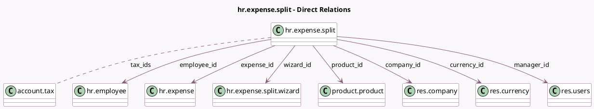

<!-- GENERATED:MODEL -->
---
tags: [odoo, community, generated, model]
---

# hr.expense.split

- Module: [[docs/Community Addons/hr_expense/hr_expense|hr_expense]]
- Scope: Community Addons
- Defined in module: yes
- Source files: `wizard/hr_expense_split.py`
- Python classes: `HrExpenseSplit`
- Description: Expense Split
- Inherits: `analytic.mixin`

## Field footprint

- Detected fields: 15
- Field types: `Boolean` x 2, `Char` x 1, `Datetime` x 1, `Many2many` x 1, `Many2one` x 7, `Monetary` x 2, `Selection` x 1
- Relation fields: 8

## Sample fields

- `approval_date`: `Datetime`
- `approval_state`: `Selection`
- `company_id`: `Many2one` (comodel `res.company`)
- `currency_id`: `Many2one` (comodel `res.currency`)
- `employee_id`: `Many2one` (comodel `hr.employee`)
- `expense_id`: `Many2one` (comodel `hr.expense`)
- `manager_id`: `Many2one` (comodel `res.users`)
- `name`: `Char`
- `product_has_cost`: `Boolean` (compute `_compute_from_product_id`, store `True`)
- `product_has_tax`: `Boolean` (compute `_compute_product_has_tax`)
- `product_id`: `Many2one` (comodel `product.product`)
- `tax_amount_currency`: `Monetary` (compute `_compute_tax_amount_currency`)
- `tax_ids`: `Many2many` (comodel `account.tax`)
- `total_amount_currency`: `Monetary` (compute `_compute_from_product_id`, store `True`)
- `wizard_id`: `Many2one` (comodel `hr.expense.split.wizard`)

## Method hints

- Detected methods: 6
- Action methods: none
- Compute methods: `_compute_from_product_id`, `_compute_product_has_tax`, `_compute_tax_amount_currency`
- Onchange methods: `_onchange_product_id`

## Direct relation diagram

## Navigation

- **Parent:** [[docs/Community Addons/hr_expense/Models]]

<!-- GENERATED:MODEL -->
