<!-- GENERATED:MODEL -->
---
tags: [odoo, community, generated, model]
---

# hr.expense.split.wizard

- Module: [[docs/Community Addons/hr_expense/hr_expense|hr_expense]]
- Scope: Community Addons
- Defined in module: yes
- Source files: `wizard/hr_expense_split_wizard.py`
- Python classes: `HrExpenseSplitWizard`
- Description: Expense Split Wizard

## Field footprint

- Detected fields: 7
- Field types: `Boolean` x 1, `Many2one` x 2, `Monetary` x 3, `One2many` x 1
- Relation fields: 3

## Sample fields

- `currency_id`: `Many2one` (comodel `res.currency`, related `expense_id.currency_id`)
- `expense_id`: `Many2one` (comodel `hr.expense`)
- `expense_split_line_ids`: `One2many` (comodel `hr.expense.split`)
- `split_possible`: `Boolean` (compute `_compute_split_possible`)
- `tax_amount_currency`: `Monetary` (compute `_compute_tax_amount_currency`)
- `total_amount_currency`: `Monetary` (compute `_compute_total_amount_currency`)
- `total_amount_currency_original`: `Monetary` (related `expense_id.total_amount_currency`)

## Method hints

- Detected methods: 4
- Action methods: `action_split_expense`
- Compute methods: `_compute_split_possible`, `_compute_tax_amount_currency`, `_compute_total_amount_currency`
- Onchange methods: none

## Direct relation diagram

```plantuml
@startuml
!define ODOO_COLOR_PRIMARY #714B67
!define ODOO_COLOR_ACCENT #875A7B
!define ODOO_COLOR_BG #FAF7FA

skinparam backgroundColor ODOO_COLOR_BG
skinparam defaultTextAlignment left
skinparam ArrowColor ODOO_COLOR_ACCENT
skinparam ClassBackgroundColor white
skinparam ClassBorderColor ODOO_COLOR_PRIMARY
skinparam ComponentBackgroundColor white
skinparam ComponentBorderColor ODOO_COLOR_PRIMARY
skinparam NoteBackgroundColor #FFF8FF
skinparam NoteBorderColor ODOO_COLOR_ACCENT
skinparam SequenceLifeLineBorderColor ODOO_COLOR_ACCENT
skinparam SequenceLifeLineBackgroundColor #FFFFFF
skinparam SequenceParticipantBorderColor ODOO_COLOR_PRIMARY
skinparam SequenceParticipantBackgroundColor #FFFFFF
skinparam sequence {
  ArrowColor ODOO_COLOR_ACCENT
  ActorBorderColor ODOO_COLOR_PRIMARY
}
title hr.expense.split.wizard - Direct Relations
class "hr.expense.split.wizard" as hr_expense_split_wizard
class "hr.expense" as hr_expense
class "hr.expense.split" as hr_expense_split
class "res.currency" as res_currency
hr_expense_split_wizard --> hr_expense : expense_id
hr_expense_split_wizard --|> hr_expense_split : expense_split_line_ids
hr_expense_split_wizard --> res_currency : currency_id
@enduml
```

## Navigation

- **Parent:** [[docs/Community Addons/hr_expense/Models]]

<!-- GENERATED:MODEL -->
