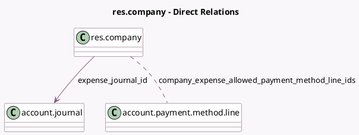

<!-- GENERATED:MODEL -->
---
tags: [odoo, community, generated, model]
---

# res.company

- Module: [[docs/Community Addons/hr_expense/hr_expense|hr_expense]]
- Scope: Community Addons
- Defined in module: extension only
- Source files: `models/res_company.py`
- Python classes: `ResCompany`

## Field footprint

- Detected fields: 2
- Field types: `Many2many` x 1, `Many2one` x 1
- Relation fields: 2

## Sample fields

- `company_expense_allowed_payment_method_line_ids`: `Many2many` (comodel `account.payment.method.line`)
- `expense_journal_id`: `Many2one` (comodel `account.journal`)

## Method hints

- Detected methods: 0
- Action methods: none
- Compute methods: none
- Onchange methods: none

## Direct relation diagram

## Navigation

- **Parent:** [[docs/Community Addons/hr_expense/Models]]

<!-- GENERATED:MODEL -->
