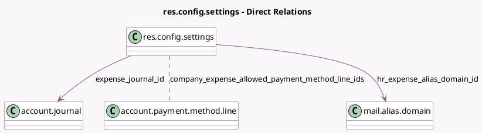

<!-- GENERATED:MODEL -->
---
tags: [odoo, community, generated, model]
---

# res.config.settings

- Module: [[docs/Community Addons/hr_expense/hr_expense|hr_expense]]
- Scope: Community Addons
- Defined in module: extension only
- Source files: `models/res_config_settings.py`
- Python classes: `ResConfigSettings`

## Field footprint

- Detected fields: 8
- Field types: `Boolean` x 4, `Char` x 1, `Many2many` x 1, `Many2one` x 2
- Relation fields: 3

## Sample fields

- `company_expense_allowed_payment_method_line_ids`: `Many2many` (comodel `account.payment.method.line`, related `company_id.company_expense_allowed_payment_method_line_ids`)
- `expense_journal_id`: `Many2one` (comodel `account.journal`, related `company_id.expense_journal_id`)
- `hr_expense_alias_domain_id`: `Many2one` (comodel `mail.alias.domain`, compute `_compute_hr_expense_alias_domain_id`)
- `hr_expense_alias_prefix`: `Char` (comodel `Default Alias Name for Expenses`, compute `_compute_hr_expense_alias_prefix`, store `True`)
- `hr_expense_use_mailgateway`: `Boolean`
- `module_hr_expense_extract`: `Boolean`
- `module_hr_expense_stripe`: `Boolean`
- `module_hr_payroll_expense`: `Boolean`

## Method hints

- Detected methods: 5
- Action methods: none
- Compute methods: `_compute_hr_expense_alias_domain_id`, `_compute_hr_expense_alias_prefix`
- Onchange methods: none

## Direct relation diagram

## Navigation

- **Parent:** [[docs/Community Addons/hr_expense/Models]]

<!-- GENERATED:MODEL -->
