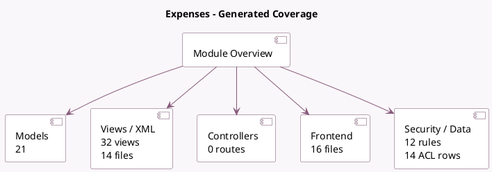

<!-- GENERATED:MODULE -->
---
tags: [odoo, community, module]
---

# Expenses

- Scope: Community Addons
- Source: odoo/addons/hr_expense
- Dependencies: [[docs/Community Addons/account/account|account]], [[docs/Community Addons/web_tour/web_tour|web_tour]], [[docs/Community Addons/hr/hr|hr]]

## Summary

Submit, validate and reinvoice employee expenses

## Generated coverage

- Models: 21
- XML files with UI/data artifacts: 14
- Views: 32
- Actions: 21
- Menus: 11
- Rules (ir.rule): 12
- Access CSV entries: 14
- Controller units: 0
- Frontend asset files: 16

## Module map

## Detail notes

- Models: [[docs/Community Addons/hr_expense/Models|Models]] (21)
- Views and XML: [[docs/Community Addons/hr_expense/Views|Views]] (14 files)
- Frontend: [[docs/Community Addons/hr_expense/Frontend|Frontend]] (16 files)

## Key models

- `account.analytic.account`
- `account.analytic.applicability`
- `account.move`
- `account.move.line`
- `account.payment`
- `account.payment.register`
- `account.tax`
- `hr.department`
- `hr.employee`
- `hr.employee.public`
- `hr.expense`
- `hr.expense.approve.duplicate`

## Navigation

- [[../Community Addons/Community Addons|Back to scope]]
- [[../../docs/docs|Back to docs]]

<!-- GENERATED:MODULE -->

