<!-- GENERATED:MODEL -->
---
tags: [odoo, community, generated, model]
---

# hr.employee

- Module: [[docs/Community Addons/hr_fleet/hr_fleet|hr_fleet]]
- Scope: Community Addons
- Defined in module: extension only
- Source files: `models/employee.py`
- Python classes: `HrEmployee`

## Field footprint

- Detected fields: 4
- Field types: `Char` x 2, `Integer` x 1, `One2many` x 1
- Relation fields: 1

## Sample fields

- `car_ids`: `One2many` (comodel `fleet.vehicle`)
- `employee_cars_count`: `Integer` (compute `_compute_employee_cars_count`)
- `license_plate`: `Char` (compute `_compute_license_plate`)
- `mobility_card`: `Char`

## Method hints

- Detected methods: 6
- Action methods: `action_open_employee_cars`
- Compute methods: `_compute_employee_cars_count`, `_compute_license_plate`
- Onchange methods: none

## Direct relation diagram

```plantuml
@startuml
!define ODOO_COLOR_PRIMARY #714B67
!define ODOO_COLOR_ACCENT #875A7B
!define ODOO_COLOR_BG #FAF7FA

skinparam backgroundColor ODOO_COLOR_BG
skinparam defaultTextAlignment left
skinparam ArrowColor ODOO_COLOR_ACCENT
skinparam ClassBackgroundColor white
skinparam ClassBorderColor ODOO_COLOR_PRIMARY
skinparam ComponentBackgroundColor white
skinparam ComponentBorderColor ODOO_COLOR_PRIMARY
skinparam NoteBackgroundColor #FFF8FF
skinparam NoteBorderColor ODOO_COLOR_ACCENT
skinparam SequenceLifeLineBorderColor ODOO_COLOR_ACCENT
skinparam SequenceLifeLineBackgroundColor #FFFFFF
skinparam SequenceParticipantBorderColor ODOO_COLOR_PRIMARY
skinparam SequenceParticipantBackgroundColor #FFFFFF
skinparam sequence {
  ArrowColor ODOO_COLOR_ACCENT
  ActorBorderColor ODOO_COLOR_PRIMARY
}
title hr.employee - Direct Relations
class "hr.employee" as hr_employee
class "fleet.vehicle" as fleet_vehicle
hr_employee --|> fleet_vehicle : car_ids
@enduml
```

## Navigation

- **Parent:** [[docs/Community Addons/hr_fleet/Models]]

<!-- GENERATED:MODEL -->
