<!-- GENERATED:MODEL -->
---
tags: [odoo, community, generated, model]
---

# gamification.badge.user.wizard

- Module: [[docs/Community Addons/hr_gamification/hr_gamification|hr_gamification]]
- Scope: Community Addons
- Defined in module: extension only
- Source files: `wizard/gamification_badge_user_wizard.py`
- Python classes: `GamificationBadgeUserWizard`

## Field footprint

- Detected fields: 2
- Field types: `Many2one` x 2
- Relation fields: 2

## Sample fields

- `employee_id`: `Many2one` (comodel `hr.employee`)
- `user_id`: `Many2one` (comodel `res.users`, compute `_compute_user_id`, store `True`)

## Method hints

- Detected methods: 2
- Action methods: `action_grant_badge`
- Compute methods: `_compute_user_id`
- Onchange methods: none

## Direct relation diagram

```plantuml
@startuml
!define ODOO_COLOR_PRIMARY #714B67
!define ODOO_COLOR_ACCENT #875A7B
!define ODOO_COLOR_BG #FAF7FA

skinparam backgroundColor ODOO_COLOR_BG
skinparam defaultTextAlignment left
skinparam ArrowColor ODOO_COLOR_ACCENT
skinparam ClassBackgroundColor white
skinparam ClassBorderColor ODOO_COLOR_PRIMARY
skinparam ComponentBackgroundColor white
skinparam ComponentBorderColor ODOO_COLOR_PRIMARY
skinparam NoteBackgroundColor #FFF8FF
skinparam NoteBorderColor ODOO_COLOR_ACCENT
skinparam SequenceLifeLineBorderColor ODOO_COLOR_ACCENT
skinparam SequenceLifeLineBackgroundColor #FFFFFF
skinparam SequenceParticipantBorderColor ODOO_COLOR_PRIMARY
skinparam SequenceParticipantBackgroundColor #FFFFFF
skinparam sequence {
  ArrowColor ODOO_COLOR_ACCENT
  ActorBorderColor ODOO_COLOR_PRIMARY
}
title gamification.badge.user.wizard - Direct Relations
class "gamification.badge.user.wizard" as gamification_badge_user_wizard
class "hr.employee" as hr_employee
class "res.users" as res_users
gamification_badge_user_wizard --> hr_employee : employee_id
gamification_badge_user_wizard --> res_users : user_id
@enduml
```

## Navigation

- **Parent:** [[docs/Community Addons/hr_gamification/Models]]

<!-- GENERATED:MODEL -->
