<!-- GENERATED:MODEL -->
---
tags: [odoo, community, generated, model]
---

# hr.employee.public

- Module: [[docs/Community Addons/hr_gamification/hr_gamification|hr_gamification]]
- Scope: Community Addons
- Defined in module: extension only
- Source files: `models/hr_employee_public.py`
- Python classes: `HrEmployeePublic`

## Field footprint

- Detected fields: 2
- Field types: `Boolean` x 1, `One2many` x 1
- Relation fields: 1

## Sample fields

- `badge_ids`: `One2many` (comodel `gamification.badge.user`, compute `_compute_badge_ids`)
- `has_badges`: `Boolean` (compute `_compute_has_badges`)

## Method hints

- Detected methods: 2
- Action methods: none
- Compute methods: `_compute_badge_ids`, `_compute_has_badges`
- Onchange methods: none

## Direct relation diagram

```plantuml
@startuml
!define ODOO_COLOR_PRIMARY #714B67
!define ODOO_COLOR_ACCENT #875A7B
!define ODOO_COLOR_BG #FAF7FA

skinparam backgroundColor ODOO_COLOR_BG
skinparam defaultTextAlignment left
skinparam ArrowColor ODOO_COLOR_ACCENT
skinparam ClassBackgroundColor white
skinparam ClassBorderColor ODOO_COLOR_PRIMARY
skinparam ComponentBackgroundColor white
skinparam ComponentBorderColor ODOO_COLOR_PRIMARY
skinparam NoteBackgroundColor #FFF8FF
skinparam NoteBorderColor ODOO_COLOR_ACCENT
skinparam SequenceLifeLineBorderColor ODOO_COLOR_ACCENT
skinparam SequenceLifeLineBackgroundColor #FFFFFF
skinparam SequenceParticipantBorderColor ODOO_COLOR_PRIMARY
skinparam SequenceParticipantBackgroundColor #FFFFFF
skinparam sequence {
  ArrowColor ODOO_COLOR_ACCENT
  ActorBorderColor ODOO_COLOR_PRIMARY
}
title hr.employee.public - Direct Relations
class "hr.employee.public" as hr_employee_public
class "gamification.badge.user" as gamification_badge_user
hr_employee_public --|> gamification_badge_user : badge_ids
@enduml
```

## Navigation

- **Parent:** [[docs/Community Addons/hr_gamification/Models]]

<!-- GENERATED:MODEL -->
