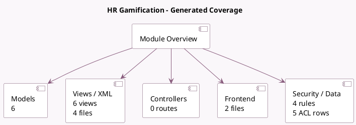

<!-- GENERATED:MODULE -->
---
tags: [odoo, community, module]
---

# HR Gamification

- Scope: Community Addons
- Source: odoo/addons/hr_gamification
- Dependencies: [[docs/Community Addons/gamification/gamification|gamification]], [[docs/Community Addons/hr/hr|hr]]

## Generated coverage

- Models: 6
- XML files with UI/data artifacts: 4
- Views: 6
- Actions: 5
- Menus: 4
- Rules (ir.rule): 4
- Access CSV entries: 5
- Controller units: 0
- Frontend asset files: 2

## Module map

## Detail notes

- Models: [[docs/Community Addons/hr_gamification/Models|Models]] (6)
- Views and XML: [[docs/Community Addons/hr_gamification/Views|Views]] (4 files)
- Frontend: [[docs/Community Addons/hr_gamification/Frontend|Frontend]] (2 files)

## Key models

- `gamification.badge`
- `gamification.badge.user`
- `gamification.badge.user.wizard`
- `hr.employee`
- `hr.employee.public`
- `res.users`

## Navigation

- [[../Community Addons/Community Addons|Back to scope]]
- [[../../docs/docs|Back to docs]]

<!-- GENERATED:MODULE -->

