<!-- GENERATED:MODEL -->
---
tags: [odoo, community, generated, model]
---

# hr.employee

- Module: [[docs/Community Addons/hr_holidays/hr_holidays|hr_holidays]]
- Scope: Community Addons
- Defined in module: extension only
- Source files: `models/hr_employee.py`
- Python classes: `HrEmployee`

## Field footprint

- Detected fields: 12
- Field types: `Boolean` x 2, `Char` x 2, `Date` x 2, `Float` x 1, `Integer` x 1, `Many2one` x 2, `Selection` x 2
- Relation fields: 2

## Sample fields

- `allocation_count`: `Float` (comodel `Total number of days allocated.`, compute `_compute_allocation_count`)
- `allocation_display`: `Char` (compute `_compute_allocation_remaining_display`)
- `allocation_remaining_display`: `Char` (compute `_compute_allocation_remaining_display`)
- `allocations_count`: `Integer` (comodel `Total number of allocations`, compute `_compute_allocation_count`)
- `current_leave_id`: `Many2one` (comodel `hr.leave.type`, compute `_compute_current_leave`)
- `current_leave_state`: `Selection` (compute `_compute_leave_status`)
- `hr_icon_display`: `Selection`
- `is_absent`: `Boolean` (comodel `Absent Today`, compute `_compute_leave_status`)
- `leave_date_from`: `Date` (comodel `From Date`, compute `_compute_leave_status`)
- `leave_date_to`: `Date` (comodel `To Date`, compute `_compute_leave_status`)
- `leave_manager_id`: `Many2one` (comodel `res.users`, compute `_compute_leave_manager`, store `True`)
- `show_leaves`: `Boolean` (comodel `Able to see Remaining Time Off`, compute `_compute_show_leaves`)

## Method hints

- Detected methods: 26
- Action methods: `action_time_off_dashboard`
- Compute methods: `_compute_allocation_count`, `_compute_allocation_remaining_display`, `_compute_current_leave`, `_compute_leave_manager`, `_compute_leave_status`, `_compute_presence_icon`, `_compute_presence_state`, `_compute_show_leaves`
- Onchange methods: none

## Direct relation diagram

```plantuml
@startuml
!define ODOO_COLOR_PRIMARY #714B67
!define ODOO_COLOR_ACCENT #875A7B
!define ODOO_COLOR_BG #FAF7FA

skinparam backgroundColor ODOO_COLOR_BG
skinparam defaultTextAlignment left
skinparam ArrowColor ODOO_COLOR_ACCENT
skinparam ClassBackgroundColor white
skinparam ClassBorderColor ODOO_COLOR_PRIMARY
skinparam ComponentBackgroundColor white
skinparam ComponentBorderColor ODOO_COLOR_PRIMARY
skinparam NoteBackgroundColor #FFF8FF
skinparam NoteBorderColor ODOO_COLOR_ACCENT
skinparam SequenceLifeLineBorderColor ODOO_COLOR_ACCENT
skinparam SequenceLifeLineBackgroundColor #FFFFFF
skinparam SequenceParticipantBorderColor ODOO_COLOR_PRIMARY
skinparam SequenceParticipantBackgroundColor #FFFFFF
skinparam sequence {
  ArrowColor ODOO_COLOR_ACCENT
  ActorBorderColor ODOO_COLOR_PRIMARY
}
title hr.employee - Direct Relations
class "hr.employee" as hr_employee
class "hr.leave.type" as hr_leave_type
class "res.users" as res_users
hr_employee --> res_users : leave_manager_id
hr_employee --> hr_leave_type : current_leave_id
@enduml
```

## Navigation

- **Parent:** [[docs/Community Addons/hr_holidays/Models]]

<!-- GENERATED:MODEL -->
