<!-- GENERATED:MODEL -->
---
tags: [odoo, community, generated, model]
---

# hr.employee.public

- Module: [[docs/Community Addons/hr_holidays/hr_holidays|hr_holidays]]
- Scope: Community Addons
- Defined in module: extension only
- Source files: `models/hr_employee_public.py`
- Python classes: `HrEmployeePublic`

## Field footprint

- Detected fields: 6
- Field types: `Boolean` x 2, `Char` x 2, `Date` x 1, `Many2one` x 1
- Relation fields: 1

## Sample fields

- `allocation_display`: `Char` (compute `_compute_allocation_display`)
- `allocation_remaining_display`: `Char` (related `employee_id.allocation_remaining_display`)
- `is_absent`: `Boolean` (comodel `Absent Today`, compute `_compute_leave_status`)
- `leave_date_to`: `Date` (comodel `To Date`, compute `_compute_leave_status`)
- `leave_manager_id`: `Many2one` (comodel `res.users`, compute `_compute_leave_manager`, store `True`)
- `show_leaves`: `Boolean` (comodel `Able to see Remaining Time Off`, compute `_compute_show_leaves`)

## Method hints

- Detected methods: 7
- Action methods: `action_open_time_off_calendar`, `action_time_off_dashboard`
- Compute methods: `_compute_allocation_display`, `_compute_leave_manager`, `_compute_leave_status`, `_compute_show_leaves`
- Onchange methods: none

## Direct relation diagram

```plantuml
@startuml
!define ODOO_COLOR_PRIMARY #714B67
!define ODOO_COLOR_ACCENT #875A7B
!define ODOO_COLOR_BG #FAF7FA

skinparam backgroundColor ODOO_COLOR_BG
skinparam defaultTextAlignment left
skinparam ArrowColor ODOO_COLOR_ACCENT
skinparam ClassBackgroundColor white
skinparam ClassBorderColor ODOO_COLOR_PRIMARY
skinparam ComponentBackgroundColor white
skinparam ComponentBorderColor ODOO_COLOR_PRIMARY
skinparam NoteBackgroundColor #FFF8FF
skinparam NoteBorderColor ODOO_COLOR_ACCENT
skinparam SequenceLifeLineBorderColor ODOO_COLOR_ACCENT
skinparam SequenceLifeLineBackgroundColor #FFFFFF
skinparam SequenceParticipantBorderColor ODOO_COLOR_PRIMARY
skinparam SequenceParticipantBackgroundColor #FFFFFF
skinparam sequence {
  ArrowColor ODOO_COLOR_ACCENT
  ActorBorderColor ODOO_COLOR_PRIMARY
}
title hr.employee.public - Direct Relations
class "hr.employee.public" as hr_employee_public
class "res.users" as res_users
hr_employee_public --> res_users : leave_manager_id
@enduml
```

## Navigation

- **Parent:** [[docs/Community Addons/hr_holidays/Models]]

<!-- GENERATED:MODEL -->
