<!-- GENERATED:MODEL -->
---
tags: [odoo, community, generated, model]
---

# hr.holidays.summary.employee

- Module: [[docs/Community Addons/hr_holidays/hr_holidays|hr_holidays]]
- Scope: Community Addons
- Defined in module: yes
- Source files: `wizard/hr_holidays_summary_employees.py`
- Python classes: `HrHolidaysSummaryEmployee`
- Description: HR Time Off Summary Report By Employee

## Field footprint

- Detected fields: 3
- Field types: `Date` x 1, `Many2many` x 1, `Selection` x 1
- Relation fields: 1

## Sample fields

- `date_from`: `Date`
- `emp`: `Many2many` (comodel `hr.employee`)
- `holiday_type`: `Selection`

## Method hints

- Detected methods: 1
- Action methods: none
- Compute methods: none
- Onchange methods: none

## Direct relation diagram

```plantuml
@startuml
!define ODOO_COLOR_PRIMARY #714B67
!define ODOO_COLOR_ACCENT #875A7B
!define ODOO_COLOR_BG #FAF7FA

skinparam backgroundColor ODOO_COLOR_BG
skinparam defaultTextAlignment left
skinparam ArrowColor ODOO_COLOR_ACCENT
skinparam ClassBackgroundColor white
skinparam ClassBorderColor ODOO_COLOR_PRIMARY
skinparam ComponentBackgroundColor white
skinparam ComponentBorderColor ODOO_COLOR_PRIMARY
skinparam NoteBackgroundColor #FFF8FF
skinparam NoteBorderColor ODOO_COLOR_ACCENT
skinparam SequenceLifeLineBorderColor ODOO_COLOR_ACCENT
skinparam SequenceLifeLineBackgroundColor #FFFFFF
skinparam SequenceParticipantBorderColor ODOO_COLOR_PRIMARY
skinparam SequenceParticipantBackgroundColor #FFFFFF
skinparam sequence {
  ArrowColor ODOO_COLOR_ACCENT
  ActorBorderColor ODOO_COLOR_PRIMARY
}
title hr.holidays.summary.employee - Direct Relations
class "hr.holidays.summary.employee" as hr_holidays_summary_employee
class "hr.employee" as hr_employee
hr_holidays_summary_employee .. hr_employee : emp
@enduml
```

## Navigation

- **Parent:** [[docs/Community Addons/hr_holidays/Models]]

<!-- GENERATED:MODEL -->
