<!-- GENERATED:MODEL -->
---
tags: [odoo, community, generated, model]
---

# hr.leave.accrual.level

- Module: [[docs/Community Addons/hr_holidays/hr_holidays|hr_holidays]]
- Scope: Community Addons
- Defined in module: yes
- Source files: `models/hr_leave_accrual_plan_level.py`
- Python classes: `HrLeaveAccrualLevel`
- Description: Accrual Plan Level

## Field footprint

- Detected fields: 30
- Field types: `Boolean` x 5, `Float` x 3, `Integer` x 4, `Many2one` x 1, `Selection` x 17
- Relation fields: 1

## Sample fields

- `accrual_plan_id`: `Many2one` (comodel `hr.leave.accrual.plan`)
- `accrual_validity`: `Boolean` (compute `_compute_accrual_validity`, store `True`)
- `accrual_validity_count`: `Integer`
- `accrual_validity_type`: `Selection`
- `accrued_gain_time`: `Selection` (related `accrual_plan_id.accrued_gain_time`)
- `action_with_unused_accruals`: `Selection` (compute `_compute_action_with_unused_accruals`, store `True`)
- `added_value`: `Float`
- `added_value_type`: `Selection` (compute `_compute_added_value_type`, store `True`)
- `can_be_carryover`: `Boolean` (related `accrual_plan_id.can_be_carryover`)
- `can_modify_value_type`: `Boolean` (compute `_compute_can_modify_value_type`)
- `cap_accrued_time`: `Boolean`
- `cap_accrued_time_yearly`: `Boolean` (store `True`)
- `carryover_options`: `Selection` (compute `_compute_carryover_options`, store `True`)
- `first_day`: `Selection`
- `first_month`: `Selection`
- `first_month_day`: `Selection` (compute `_compute_first_month_day`, store `True`)
- `frequency`: `Selection`
- `maximum_leave`: `Float` (compute `_compute_maximum_leave`, store `True`)
- `maximum_leave_yearly`: `Float`
- `milestone_date`: `Selection` (compute `_compute_milestone_date`, store `True`)

## Method hints

- Detected methods: 21
- Action methods: `action_save_new`
- Compute methods: `_compute_accrual_validity`, `_compute_action_with_unused_accruals`, `_compute_added_value_type`, `_compute_can_modify_value_type`, `_compute_carryover_options`, `_compute_first_month_day`, `_compute_maximum_leave`, `_compute_milestone_date`, and 3 more
- Onchange methods: none

## Direct relation diagram

```plantuml
@startuml
!define ODOO_COLOR_PRIMARY #714B67
!define ODOO_COLOR_ACCENT #875A7B
!define ODOO_COLOR_BG #FAF7FA

skinparam backgroundColor ODOO_COLOR_BG
skinparam defaultTextAlignment left
skinparam ArrowColor ODOO_COLOR_ACCENT
skinparam ClassBackgroundColor white
skinparam ClassBorderColor ODOO_COLOR_PRIMARY
skinparam ComponentBackgroundColor white
skinparam ComponentBorderColor ODOO_COLOR_PRIMARY
skinparam NoteBackgroundColor #FFF8FF
skinparam NoteBorderColor ODOO_COLOR_ACCENT
skinparam SequenceLifeLineBorderColor ODOO_COLOR_ACCENT
skinparam SequenceLifeLineBackgroundColor #FFFFFF
skinparam SequenceParticipantBorderColor ODOO_COLOR_PRIMARY
skinparam SequenceParticipantBackgroundColor #FFFFFF
skinparam sequence {
  ArrowColor ODOO_COLOR_ACCENT
  ActorBorderColor ODOO_COLOR_PRIMARY
}
title hr.leave.accrual.level - Direct Relations
class "hr.leave.accrual.level" as hr_leave_accrual_level
class "hr.leave.accrual.plan" as hr_leave_accrual_plan
hr_leave_accrual_level --> hr_leave_accrual_plan : accrual_plan_id
@enduml
```

## Navigation

- **Parent:** [[docs/Community Addons/hr_holidays/Models]]

<!-- GENERATED:MODEL -->
