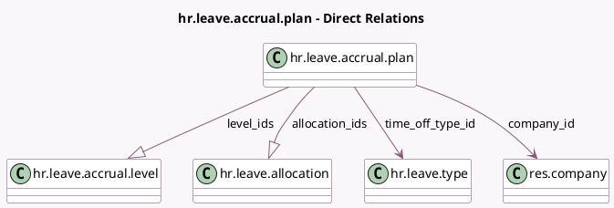

<!-- GENERATED:MODEL -->
---
tags: [odoo, community, generated, model]
---

# hr.leave.accrual.plan

- Module: [[docs/Community Addons/hr_holidays/hr_holidays|hr_holidays]]
- Scope: Community Addons
- Defined in module: yes
- Source files: `models/hr_leave_accrual_plan.py`
- Python classes: `HrLeaveAccrualPlan`
- Description: Accrual Plan

## Field footprint

- Detected fields: 17
- Field types: `Boolean` x 4, `Char` x 1, `Integer` x 2, `Many2one` x 2, `One2many` x 2, `Selection` x 6
- Relation fields: 4

## Sample fields

- `accrued_gain_time`: `Selection`
- `active`: `Boolean`
- `added_value_type`: `Selection` (store `True`)
- `allocation_ids`: `One2many` (comodel `hr.leave.allocation`)
- `can_be_carryover`: `Boolean`
- `carryover_date`: `Selection`
- `carryover_day`: `Selection` (compute `_compute_carryover_day`, store `True`)
- `carryover_month`: `Selection`
- `company_id`: `Many2one` (comodel `res.company`, compute `_compute_company_id`)
- `employees_count`: `Integer` (comodel `Employees`, compute `_compute_employee_count`)
- `is_based_on_worked_time`: `Boolean` (compute `_compute_is_based_on_worked_time`, store `True`)
- `level_count`: `Integer` (comodel `Levels`, compute `_compute_level_count`)
- `level_ids`: `One2many` (comodel `hr.leave.accrual.level`)
- `name`: `Char` (comodel `Name`)
- `show_transition_mode`: `Boolean` (compute `_compute_show_transition_mode`)
- `time_off_type_id`: `Many2one` (comodel `hr.leave.type`)
- `transition_mode`: `Selection`

## Method hints

- Detected methods: 12
- Action methods: `action_create_accrual_plan_level`, `action_open_accrual_plan_employees`, `action_open_accrual_plan_level`
- Compute methods: `_compute_carryover_day`, `_compute_company_id`, `_compute_employee_count`, `_compute_is_based_on_worked_time`, `_compute_level_count`, `_compute_show_transition_mode`
- Onchange methods: none

## Direct relation diagram

## Navigation

- **Parent:** [[docs/Community Addons/hr_holidays/Models]]

<!-- GENERATED:MODEL -->
