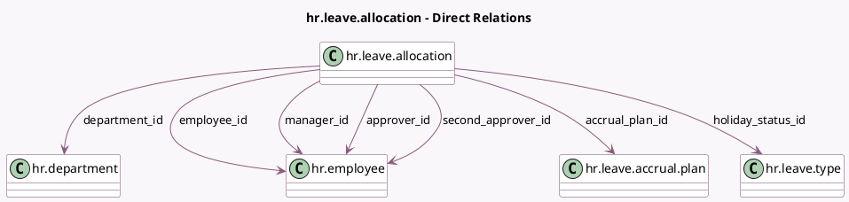

<!-- GENERATED:MODEL -->
---
tags: [odoo, community, generated, model]
---

# hr.leave.allocation

- Module: [[docs/Community Addons/hr_holidays/hr_holidays|hr_holidays]]
- Scope: Community Addons
- Defined in module: yes
- Source files: `models/hr_leave_allocation.py`
- Python classes: `HrLeaveAllocation`
- Description: Time Off Allocation
- Inherits: `mail.activity.mixin`, `mail.thread`

## Field footprint

- Detected fields: 38
- Field types: `Boolean` x 7, `Char` x 3, `Date` x 7, `Float` x 8, `Many2one` x 8, `Selection` x 4, `Text` x 1
- Relation fields: 8

## Sample fields

- `accrual_plan_id`: `Many2one` (comodel `hr.leave.accrual.plan`, compute `_compute_accrual_plan_id`, store `True`)
- `active_employee`: `Boolean` (comodel `Active Employee`, related `employee_id.active`)
- `actual_lastcall`: `Date`
- `allocation_type`: `Selection`
- `already_accrued`: `Boolean`
- `approver_id`: `Many2one` (comodel `hr.employee`)
- `can_approve`: `Boolean` (comodel `Can Approve`, compute `_compute_can_approve`)
- `can_refuse`: `Boolean` (comodel `Can Refuse`, compute `_compute_can_refuse`)
- `can_validate`: `Boolean` (comodel `Can Validate`, compute `_compute_can_validate`)
- `carried_over_days_expiration_date`: `Date` (comodel `Carried over days expiration date`)
- `date_from`: `Date` (comodel `Start Date`)
- `date_to`: `Date` (comodel `End Date`)
- `department_id`: `Many2one` (comodel `hr.department`, compute `_compute_department_id`, store `True`)
- `duration_display`: `Char` (comodel `Allocated (Days/Hours)`, compute `_compute_duration_display`)
- `employee_company_id`: `Many2one` (related `employee_id.company_id`, store `True`)
- `employee_id`: `Many2one` (comodel `hr.employee`)
- `expiring_carryover_days`: `Float` (comodel `The number of carried over days that will expire on carried_over_days_expiration_date`)
- `holiday_status_id`: `Many2one` (comodel `hr.leave.type`, compute `_compute_holiday_status_id`, store `True`)
- `is_name_custom`: `Boolean` (store `False`)
- `is_officer`: `Boolean` (compute `_compute_is_officer`)

## Method hints

- Detected methods: 53
- Action methods: `action_approve`, `action_refuse`
- Compute methods: `_compute_accrual_plan_id`, `_compute_can_approve`, `_compute_can_refuse`, `_compute_can_validate`, `_compute_department_id`, `_compute_description`, `_compute_description_validity`, `_compute_display_name`, and 9 more
- Onchange methods: `_onchange_allocation_type`, `_onchange_date_from`, `_onchange_name`

## Direct relation diagram

## Navigation

- **Parent:** [[docs/Community Addons/hr_holidays/Models]]

<!-- GENERATED:MODEL -->
