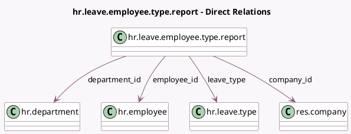

<!-- GENERATED:MODEL -->
---
tags: [odoo, community, generated, model]
---

# hr.leave.employee.type.report

- Module: [[docs/Community Addons/hr_holidays/hr_holidays|hr_holidays]]
- Scope: Community Addons
- Defined in module: yes
- Source files: `report/hr_leave_employee_type_report.py`
- Python classes: `HrLeaveEmployeeTypeReport`
- Description: Time Off Summary / Report

## Field footprint

- Detected fields: 11
- Field types: `Boolean` x 1, `Datetime` x 2, `Float` x 2, `Many2one` x 4, `Selection` x 2
- Relation fields: 4

## Sample fields

- `active_employee`: `Boolean`
- `company_id`: `Many2one` (comodel `res.company`)
- `date_from`: `Datetime` (comodel `Start Date`)
- `date_to`: `Datetime` (comodel `End Date`)
- `department_id`: `Many2one` (comodel `hr.department`)
- `employee_id`: `Many2one` (comodel `hr.employee`)
- `holiday_status`: `Selection`
- `leave_type`: `Many2one` (comodel `hr.leave.type`)
- `number_of_days`: `Float` (comodel `Number of Days`)
- `number_of_hours`: `Float` (comodel `Number of Hours`)
- `state`: `Selection`

## Method hints

- Detected methods: 2
- Action methods: `action_time_off_analysis`
- Compute methods: none
- Onchange methods: none

## Direct relation diagram

## Navigation

- **Parent:** [[docs/Community Addons/hr_holidays/Models]]

<!-- GENERATED:MODEL -->
