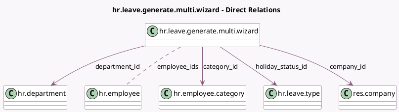

<!-- GENERATED:MODEL -->
---
tags: [odoo, community, generated, model]
---

# hr.leave.generate.multi.wizard

- Module: [[docs/Community Addons/hr_holidays/hr_holidays|hr_holidays]]
- Scope: Community Addons
- Defined in module: yes
- Source files: `wizard/hr_leave_generate_multi_wizard.py`
- Python classes: `HrLeaveGenerateMultiWizard`
- Description: Generate time off for multiple employees

## Field footprint

- Detected fields: 9
- Field types: `Char` x 1, `Date` x 2, `Many2many` x 1, `Many2one` x 4, `Selection` x 1
- Relation fields: 5

## Sample fields

- `allocation_mode`: `Selection`
- `category_id`: `Many2one` (comodel `hr.employee.category`)
- `company_id`: `Many2one` (comodel `res.company`)
- `date_from`: `Date` (comodel `Start Date`)
- `date_to`: `Date` (comodel `End Date`)
- `department_id`: `Many2one` (comodel `hr.department`)
- `employee_ids`: `Many2many` (comodel `hr.employee`)
- `holiday_status_id`: `Many2one` (comodel `hr.leave.type`)
- `name`: `Char` (comodel `Description`)

## Method hints

- Detected methods: 5
- Action methods: `action_generate_time_off`
- Compute methods: none
- Onchange methods: none

## Direct relation diagram

## Navigation

- **Parent:** [[docs/Community Addons/hr_holidays/Models]]

<!-- GENERATED:MODEL -->
