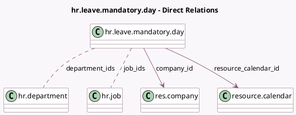

<!-- GENERATED:MODEL -->
---
tags: [odoo, community, generated, model]
---

# hr.leave.mandatory.day

- Module: [[docs/Community Addons/hr_holidays/hr_holidays|hr_holidays]]
- Scope: Community Addons
- Defined in module: yes
- Source files: `models/hr_leave_mandatory_day.py`
- Python classes: `HrLeaveMandatoryDay`
- Description: Mandatory Day

## Field footprint

- Detected fields: 8
- Field types: `Char` x 1, `Date` x 2, `Integer` x 1, `Many2many` x 2, `Many2one` x 2
- Relation fields: 4

## Sample fields

- `color`: `Integer`
- `company_id`: `Many2one` (comodel `res.company`)
- `department_ids`: `Many2many` (comodel `hr.department`)
- `end_date`: `Date`
- `job_ids`: `Many2many` (comodel `hr.job`)
- `name`: `Char`
- `resource_calendar_id`: `Many2one` (comodel `resource.calendar`)
- `start_date`: `Date`

## Method hints

- Detected methods: 0
- Action methods: none
- Compute methods: none
- Onchange methods: none

## Direct relation diagram

## Navigation

- **Parent:** [[docs/Community Addons/hr_holidays/Models]]

<!-- GENERATED:MODEL -->
