<!-- GENERATED:MODEL -->
---
tags: [odoo, community, generated, model]
---

# hr.leave

- Module: [[docs/Community Addons/hr_holidays/hr_holidays|hr_holidays]]
- Scope: Community Addons
- Defined in module: yes
- Source files: `models/hr_leave.py`
- Python classes: `HrLeave`
- Description: Time Off
- Inherits: `mail.activity.mixin`, `mail.thread.main.attachment`

## Field footprint

- Detected fields: 51
- Field types: `Boolean` x 15, `Char` x 5, `Date` x 2, `Datetime` x 2, `Float` x 6, `Integer` x 2, `Many2many` x 1, `Many2one` x 10, `One2many` x 1, `Selection` x 6, `Text` x 1
- Relation fields: 12

## Sample fields

- `active_employee`: `Boolean` (related `employee_id.active`)
- `attachment_ids`: `One2many` (comodel `ir.attachment`)
- `can_approve`: `Boolean` (compute `_compute_can_approve`)
- `can_back_to_approve`: `Boolean` (compute `_compute_can_back_to_approve`)
- `can_cancel`: `Boolean` (compute `_compute_can_cancel`)
- `can_refuse`: `Boolean` (compute `_compute_can_refuse`)
- `can_validate`: `Boolean` (compute `_compute_can_validate`)
- `color`: `Integer` (comodel `Color`, related `holiday_status_id.color`)
- `company_id`: `Many2one` (comodel `res.company`, compute `_compute_company_id`, store `True`)
- `dashboard_warning_message`: `Char` (compute `_compute_dashboard_warning_message`)
- `date_from`: `Datetime` (comodel `Start Date`, compute `_compute_date_from_to`, store `True`)
- `date_to`: `Datetime` (comodel `End Date`, compute `_compute_date_from_to`, store `True`)
- `department_id`: `Many2one` (comodel `hr.department`, compute `_compute_department_id`, store `True`)
- `duration_display`: `Char` (comodel `Requested`, compute `_compute_duration_display`, store `True`)
- `employee_company_id`: `Many2one` (related `employee_id.company_id`, store `True`)
- `employee_id`: `Many2one` (comodel `hr.employee`)
- `first_approver_id`: `Many2one` (comodel `hr.employee`)
- `has_mandatory_day`: `Boolean` (compute `_compute_has_mandatory_day`)
- `holiday_status_id`: `Many2one` (comodel `hr.leave.type`, compute `_compute_from_employee_id`, store `True`)
- `holiday_status_requires_allocation`: `Boolean` (related `holiday_status_id.requires_allocation`)

## Method hints

- Detected methods: 79
- Action methods: `action_approve`, `action_back_to_approval`, `action_cancel`, `action_documents`, `action_refuse`
- Compute methods: `_compute_can_approve`, `_compute_can_back_to_approve`, `_compute_can_cancel`, `_compute_can_refuse`, `_compute_can_validate`, `_compute_company_id`, `_compute_dashboard_warning_message`, `_compute_date_from_to`, and 18 more
- Onchange methods: `_onchange_hours`

## Direct relation diagram

```plantuml
@startuml
!define ODOO_COLOR_PRIMARY #714B67
!define ODOO_COLOR_ACCENT #875A7B
!define ODOO_COLOR_BG #FAF7FA

skinparam backgroundColor ODOO_COLOR_BG
skinparam defaultTextAlignment left
skinparam ArrowColor ODOO_COLOR_ACCENT
skinparam ClassBackgroundColor white
skinparam ClassBorderColor ODOO_COLOR_PRIMARY
skinparam ComponentBackgroundColor white
skinparam ComponentBorderColor ODOO_COLOR_PRIMARY
skinparam NoteBackgroundColor #FFF8FF
skinparam NoteBorderColor ODOO_COLOR_ACCENT
skinparam SequenceLifeLineBorderColor ODOO_COLOR_ACCENT
skinparam SequenceLifeLineBackgroundColor #FFFFFF
skinparam SequenceParticipantBorderColor ODOO_COLOR_PRIMARY
skinparam SequenceParticipantBackgroundColor #FFFFFF
skinparam sequence {
  ArrowColor ODOO_COLOR_ACCENT
  ActorBorderColor ODOO_COLOR_PRIMARY
}
title hr.leave - Direct Relations
class "hr.leave" as hr_leave
class "calendar.event" as calendar_event
class "hr.department" as hr_department
class "hr.employee" as hr_employee
class "hr.leave.type" as hr_leave_type
class "ir.attachment" as ir_attachment
class "res.company" as res_company
class "res.users" as res_users
class "resource.calendar" as resource_calendar
hr_leave --> res_users : user_id
hr_leave --> hr_leave_type : holiday_status_id
hr_leave --> hr_employee : employee_id
hr_leave --> res_company : company_id
hr_leave --> hr_department : department_id
hr_leave --> resource_calendar : resource_calendar_id
hr_leave --> calendar_event : meeting_id
hr_leave --> hr_employee : first_approver_id
hr_leave --> hr_employee : second_approver_id
hr_leave --|> ir_attachment : attachment_ids
hr_leave .. ir_attachment : supported_attachment_ids
@enduml
```

## Navigation

- **Parent:** [[docs/Community Addons/hr_holidays/Models]]

<!-- GENERATED:MODEL -->
