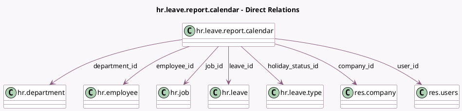

<!-- GENERATED:MODEL -->
---
tags: [odoo, community, generated, model]
---

# hr.leave.report.calendar

- Module: [[docs/Community Addons/hr_holidays/hr_holidays|hr_holidays]]
- Scope: Community Addons
- Defined in module: yes
- Source files: `report/hr_leave_report_calendar.py`
- Python classes: `HrLeaveReportCalendar`
- Description: Time Off Calendar

## Field footprint

- Detected fields: 20
- Field types: `Boolean` x 4, `Char` x 3, `Datetime` x 2, `Float` x 1, `Many2one` x 8, `Selection` x 2
- Relation fields: 8

## Sample fields

- `company_id`: `Many2one` (comodel `res.company`)
- `department_id`: `Many2one` (comodel `hr.department`)
- `description`: `Char` (comodel `Description`)
- `duration`: `Float`
- `duration_display`: `Char` (related `leave_id.duration_display`)
- `employee_id`: `Many2one` (comodel `hr.employee`)
- `holiday_status_id`: `Many2one` (comodel `hr.leave.type`)
- `is_absent`: `Boolean` (related `employee_id.is_absent`)
- `is_hatched`: `Boolean` (comodel `Hatched`)
- `is_manager`: `Boolean` (comodel `Manager`, compute `_compute_is_manager`)
- `is_striked`: `Boolean` (comodel `Striked`)
- `job_id`: `Many2one` (comodel `hr.job`)
- `leave_id`: `Many2one` (comodel `hr.leave`)
- `leave_manager_id`: `Many2one` (related `employee_id.leave_manager_id`)
- `name`: `Char` (compute `_compute_name`)
- `start_datetime`: `Datetime`
- `state`: `Selection`
- `stop_datetime`: `Datetime`
- `tz`: `Selection`
- `user_id`: `Many2one` (comodel `res.users`)

## Method hints

- Detected methods: 7
- Action methods: `action_approve`, `action_refuse`
- Compute methods: `_compute_display_name`, `_compute_is_manager`, `_compute_name`
- Onchange methods: none

## Direct relation diagram

## Navigation

- **Parent:** [[docs/Community Addons/hr_holidays/Models]]

<!-- GENERATED:MODEL -->
