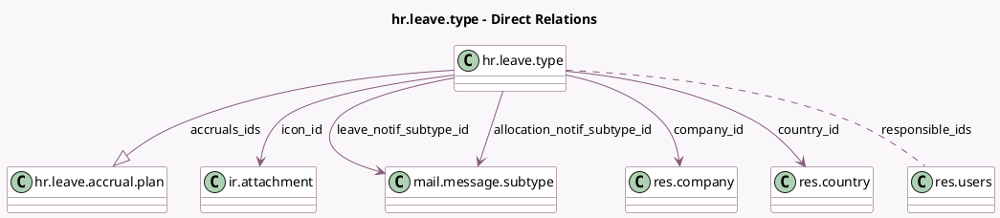

<!-- GENERATED:MODEL -->
---
tags: [odoo, community, generated, model]
---

# hr.leave.type

- Module: [[docs/Community Addons/hr_holidays/hr_holidays|hr_holidays]]
- Scope: Community Addons
- Defined in module: yes
- Source files: `models/hr_leave_type.py`
- Python classes: `HrLeaveType`
- Description: Time Off Type

## Field footprint

- Detected fields: 35
- Field types: `Boolean` x 13, `Char` x 2, `Float` x 5, `Integer` x 4, `Many2many` x 1, `Many2one` x 5, `One2many` x 1, `Selection` x 4
- Relation fields: 7

## Sample fields

- `accrual_count`: `Float` (compute `_compute_accrual_count`)
- `accruals_ids`: `One2many` (comodel `hr.leave.accrual.plan`)
- `active`: `Boolean` (comodel `Active`)
- `allocation_count`: `Integer` (compute `_compute_allocation_count`)
- `allocation_notif_subtype_id`: `Many2one` (comodel `mail.message.subtype`)
- `allocation_validation_type`: `Selection`
- `allow_request_on_top`: `Boolean`
- `allows_negative`: `Boolean`
- `color`: `Integer`
- `company_id`: `Many2one` (comodel `res.company`)
- `country_code`: `Char` (related `country_id.code`)
- `country_id`: `Many2one` (comodel `res.country`, compute `_compute_country_id`, store `True`)
- `create_calendar_meeting`: `Boolean`
- `elligible_for_accrual_rate`: `Boolean` (compute `_compute_eligible_for_accrual_rate`, store `True`)
- `employee_requests`: `Boolean`
- `group_days_leave`: `Float` (compute `_compute_group_days_leave`)
- `has_valid_allocation`: `Boolean` (compute `_compute_valid`)
- `hide_on_dashboard`: `Boolean`
- `icon_id`: `Many2one` (comodel `ir.attachment`)
- `include_public_holidays_in_duration`: `Boolean` (comodel `Ignore Public Holidays`)

## Method hints

- Detected methods: 31
- Action methods: `action_see_accrual_plans`, `action_see_days_allocated`, `action_see_group_leaves`
- Compute methods: `_compute_accrual_count`, `_compute_allocation_count`, `_compute_country_id`, `_compute_display_name`, `_compute_eligible_for_accrual_rate`, `_compute_group_days_leave`, `_compute_is_used`, `_compute_leaves`, and 1 more
- Onchange methods: none

## Direct relation diagram

## Navigation

- **Parent:** [[docs/Community Addons/hr_holidays/Models]]

<!-- GENERATED:MODEL -->
