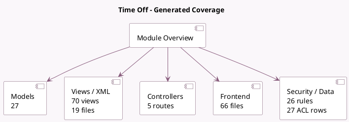

<!-- GENERATED:MODULE -->
---
tags: [odoo, community, module]
---

# Time Off

- Scope: Community Addons
- Source: odoo/addons/hr_holidays
- Dependencies: [[docs/Community Addons/hr/hr|hr]], [[docs/Community Addons/calendar/calendar|calendar]], [[docs/Community Addons/resource/resource|resource]]

## Summary

Allocate time off and follow leave requests

## Generated coverage

- Models: 27
- XML files with UI/data artifacts: 19
- Views: 70
- Actions: 42
- Menus: 19
- Rules (ir.rule): 26
- Access CSV entries: 27
- Controller units: 1
- Frontend asset files: 66

## Module map

## Detail notes

- Models: [[docs/Community Addons/hr_holidays/Models|Models]] (27)
- Views and XML: [[docs/Community Addons/hr_holidays/Views|Views]] (19 files)
- Controllers: [[docs/Community Addons/hr_holidays/Controllers|Controllers]] (1)
- Frontend: [[docs/Community Addons/hr_holidays/Frontend|Frontend]] (66 files)

## Key models

- `calendar.event`
- `hr.department`
- `hr.departure.wizard`
- `hr.employee`
- `hr.employee.public`
- `hr.holidays.cancel.leave`
- `hr.holidays.summary.employee`
- `hr.leave`
- `hr.leave.accrual.level`
- `hr.leave.accrual.plan`
- `hr.leave.allocation`
- `hr.leave.allocation.generate.multi.wizard`

## Navigation

- [[../Community Addons/Community Addons|Back to scope]]
- [[../../docs/docs|Back to docs]]

<!-- GENERATED:MODULE -->

