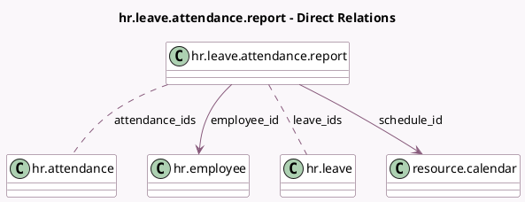

<!-- GENERATED:MODEL -->
---
tags: [odoo, community, generated, model]
---

# hr.leave.attendance.report

- Module: [[docs/Community Addons/hr_holidays_attendance/hr_holidays_attendance|hr_holidays_attendance]]
- Scope: Community Addons
- Defined in module: yes
- Source files: `report/hr_leave_attendance_report.py`
- Python classes: `HrLeaveAttendanceReport`
- Description: Attendance and Leave Analysis Report

## Field footprint

- Detected fields: 13
- Field types: `Boolean` x 1, `Char` x 1, `Date` x 1, `Float` x 4, `Many2many` x 2, `Many2one` x 4
- Relation fields: 6

## Sample fields

- `active`: `Boolean` (related `employee_id.active`)
- `attendance_ids`: `Many2many` (comodel `hr.attendance`, compute `_compute_leave_attendance_fields`)
- `date`: `Date` (comodel `Date`)
- `department_id`: `Many2one` (related `employee_id.department_id`)
- `difference_hours`: `Float` (comodel `Difference`)
- `employee_id`: `Many2one` (comodel `hr.employee`)
- `expected_hours`: `Float` (comodel `Expected Hours`)
- `job_id`: `Many2one` (related `employee_id.job_id`)
- `leave_hours`: `Float` (comodel `Approved Time Off`)
- `leave_ids`: `Many2many` (comodel `hr.leave`, compute `_compute_leave_attendance_fields`)
- `leave_type_names`: `Char` (comodel `Time Off Types`, compute `_compute_leave_attendance_fields`)
- `schedule_id`: `Many2one` (comodel `resource.calendar`)
- `worked_hours`: `Float` (comodel `Worked Hours`)

## Method hints

- Detected methods: 13
- Action methods: none
- Compute methods: `_compute_display_name`, `_compute_leave_attendance_fields`
- Onchange methods: none

## Direct relation diagram

## Navigation

- **Parent:** [[docs/Community Addons/hr_holidays_attendance/Models]]

<!-- GENERATED:MODEL -->
