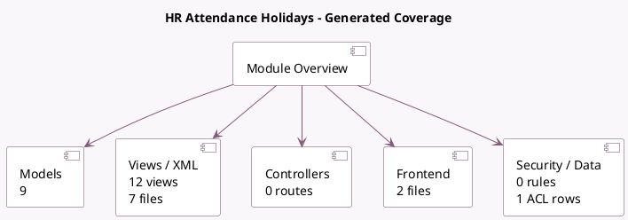

<!-- GENERATED:MODULE -->
---
tags: [odoo, community, module]
---

# HR Attendance Holidays

- Scope: Community Addons
- Source: odoo/addons/hr_holidays_attendance
- Dependencies: [[docs/Community Addons/hr_attendance/hr_attendance|hr_attendance]], [[docs/Community Addons/hr_holidays/hr_holidays|hr_holidays]]

## Summary

Attendance Holidays

## Generated coverage

- Models: 9
- XML files with UI/data artifacts: 7
- Views: 12
- Actions: 2
- Menus: 1
- Rules (ir.rule): 0
- Access CSV entries: 1
- Controller units: 0
- Frontend asset files: 2

## Module map

## Detail notes

- Models: [[docs/Community Addons/hr_holidays_attendance/Models|Models]] (9)
- Views and XML: [[docs/Community Addons/hr_holidays_attendance/Views|Views]] (7 files)
- Frontend: [[docs/Community Addons/hr_holidays_attendance/Frontend|Frontend]] (2 files)

## Key models

- `hr.attendance.overtime.line`
- `hr.attendance.overtime.rule`
- `hr.employee`
- `hr.leave`
- `hr.leave.accrual.level`
- `hr.leave.allocation`
- `hr.leave.attendance.report`
- `hr.leave.type`
- `ir.ui.menu`

## Navigation

- [[../Community Addons/Community Addons|Back to scope]]
- [[../../docs/docs|Back to docs]]

<!-- GENERATED:MODULE -->

