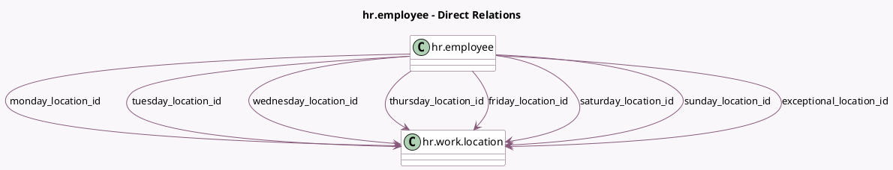

<!-- GENERATED:MODEL -->
---
tags: [odoo, community, generated, model]
---

# hr.employee

- Module: [[docs/Community Addons/hr_homeworking/hr_homeworking|hr_homeworking]]
- Scope: Community Addons
- Defined in module: extension only
- Source files: `models/hr_employee.py`
- Python classes: `HrEmployee`

## Field footprint

- Detected fields: 10
- Field types: `Char` x 1, `Many2one` x 8, `Selection` x 1
- Relation fields: 8

## Sample fields

- `exceptional_location_id`: `Many2one` (comodel `hr.work.location`, compute `_compute_exceptional_location_id`)
- `friday_location_id`: `Many2one` (comodel `hr.work.location`)
- `hr_icon_display`: `Selection`
- `monday_location_id`: `Many2one` (comodel `hr.work.location`)
- `saturday_location_id`: `Many2one` (comodel `hr.work.location`)
- `sunday_location_id`: `Many2one` (comodel `hr.work.location`)
- `thursday_location_id`: `Many2one` (comodel `hr.work.location`)
- `today_location_name`: `Char`
- `tuesday_location_id`: `Many2one` (comodel `hr.work.location`)
- `wednesday_location_id`: `Many2one` (comodel `hr.work.location`)

## Method hints

- Detected methods: 6
- Action methods: none
- Compute methods: `_compute_exceptional_location_id`, `_compute_presence_icon`, `_compute_work_location_name`, `_compute_work_location_type`
- Onchange methods: none

## Direct relation diagram

## Navigation

- **Parent:** [[docs/Community Addons/hr_homeworking/Models]]

<!-- GENERATED:MODEL -->
