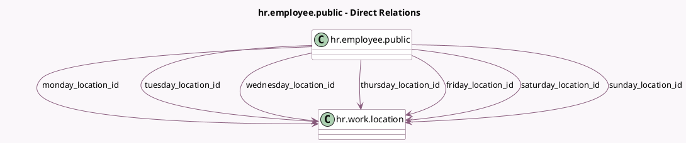

<!-- GENERATED:MODEL -->
---
tags: [odoo, community, generated, model]
---

# hr.employee.public

- Module: [[docs/Community Addons/hr_homeworking/hr_homeworking|hr_homeworking]]
- Scope: Community Addons
- Defined in module: extension only
- Source files: `models/hr_employee_public.py`
- Python classes: `HrEmployeePublic`

## Field footprint

- Detected fields: 8
- Field types: `Char` x 1, `Many2one` x 7
- Relation fields: 7

## Sample fields

- `friday_location_id`: `Many2one` (comodel `hr.work.location`)
- `monday_location_id`: `Many2one` (comodel `hr.work.location`)
- `saturday_location_id`: `Many2one` (comodel `hr.work.location`)
- `sunday_location_id`: `Many2one` (comodel `hr.work.location`)
- `thursday_location_id`: `Many2one` (comodel `hr.work.location`)
- `today_location_name`: `Char`
- `tuesday_location_id`: `Many2one` (comodel `hr.work.location`)
- `wednesday_location_id`: `Many2one` (comodel `hr.work.location`)

## Method hints

- Detected methods: 0
- Action methods: none
- Compute methods: none
- Onchange methods: none

## Direct relation diagram

## Navigation

- **Parent:** [[docs/Community Addons/hr_homeworking/Models]]

<!-- GENERATED:MODEL -->
