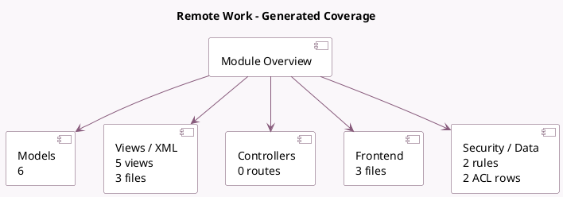

<!-- GENERATED:MODULE -->
---
tags: [odoo, community, module]
---

# Remote Work

- Scope: Community Addons
- Source: odoo/addons/hr_homeworking
- Dependencies: [[docs/Community Addons/hr/hr|hr]]

## Generated coverage

- Models: 6
- XML files with UI/data artifacts: 3
- Views: 5
- Actions: 0
- Menus: 0
- Rules (ir.rule): 2
- Access CSV entries: 2
- Controller units: 0
- Frontend asset files: 3

## Module map

## Detail notes

- Models: [[docs/Community Addons/hr_homeworking/Models|Models]] (6)
- Views and XML: [[docs/Community Addons/hr_homeworking/Views|Views]] (3 files)
- Frontend: [[docs/Community Addons/hr_homeworking/Frontend|Frontend]] (3 files)

## Key models

- `hr.employee`
- `hr.employee.location`
- `hr.employee.public`
- `hr.work.location`
- `res.partner`
- `res.users`

## Navigation

- [[../Community Addons/Community Addons|Back to scope]]
- [[../../docs/docs|Back to docs]]

<!-- GENERATED:MODULE -->

