<!-- GENERATED:MODEL -->
---
tags: [odoo, community, generated, model]
---

# homework.location.wizard

- Module: [[docs/Community Addons/hr_homeworking_calendar/hr_homeworking_calendar|hr_homeworking_calendar]]
- Scope: Community Addons
- Defined in module: yes
- Source files: `wizard/homework_location_wizard.py`
- Python classes: `HomeworkLocationWizard`
- Description: Set Homework Location Wizard

## Field footprint

- Detected fields: 8
- Field types: `Boolean` x 1, `Char` x 3, `Date` x 1, `Many2one` x 2, `Selection` x 1
- Relation fields: 2

## Sample fields

- `date`: `Date`
- `day_week_string`: `Char` (compute `_compute_day_week_string`)
- `employee_id`: `Many2one` (comodel `hr.employee`)
- `employee_name`: `Char` (related `employee_id.name`)
- `weekly`: `Boolean`
- `work_location_id`: `Many2one` (comodel `hr.work.location`)
- `work_location_name`: `Char` (related `work_location_id.name`)
- `work_location_type`: `Selection` (related `work_location_id.location_type`)

## Method hints

- Detected methods: 2
- Action methods: none
- Compute methods: `_compute_day_week_string`
- Onchange methods: none

## Direct relation diagram

```plantuml
@startuml
!define ODOO_COLOR_PRIMARY #714B67
!define ODOO_COLOR_ACCENT #875A7B
!define ODOO_COLOR_BG #FAF7FA

skinparam backgroundColor ODOO_COLOR_BG
skinparam defaultTextAlignment left
skinparam ArrowColor ODOO_COLOR_ACCENT
skinparam ClassBackgroundColor white
skinparam ClassBorderColor ODOO_COLOR_PRIMARY
skinparam ComponentBackgroundColor white
skinparam ComponentBorderColor ODOO_COLOR_PRIMARY
skinparam NoteBackgroundColor #FFF8FF
skinparam NoteBorderColor ODOO_COLOR_ACCENT
skinparam SequenceLifeLineBorderColor ODOO_COLOR_ACCENT
skinparam SequenceLifeLineBackgroundColor #FFFFFF
skinparam SequenceParticipantBorderColor ODOO_COLOR_PRIMARY
skinparam SequenceParticipantBackgroundColor #FFFFFF
skinparam sequence {
  ArrowColor ODOO_COLOR_ACCENT
  ActorBorderColor ODOO_COLOR_PRIMARY
}
title homework.location.wizard - Direct Relations
class "homework.location.wizard" as homework_location_wizard
class "hr.employee" as hr_employee
class "hr.work.location" as hr_work_location
homework_location_wizard --> hr_work_location : work_location_id
homework_location_wizard --> hr_employee : employee_id
@enduml
```

## Navigation

- **Parent:** [[docs/Community Addons/hr_homeworking_calendar/Models]]

<!-- GENERATED:MODEL -->
