<!-- GENERATED:MODEL -->
---
tags: [odoo, community, generated, model]
---

# maintenance.request

- Module: [[docs/Community Addons/hr_maintenance/hr_maintenance|hr_maintenance]]
- Scope: Community Addons
- Defined in module: extension only
- Source files: `models/equipment.py`
- Python classes: `MaintenanceRequest`

## Field footprint

- Detected fields: 3
- Field types: `Many2one` x 3
- Relation fields: 3

## Sample fields

- `employee_id`: `Many2one` (comodel `hr.employee`)
- `equipment_id`: `Many2one`
- `owner_user_id`: `Many2one` (compute `_compute_owner`, store `True`)

## Method hints

- Detected methods: 5
- Action methods: none
- Compute methods: `_compute_owner`
- Onchange methods: none

## Direct relation diagram

```plantuml
@startuml
!define ODOO_COLOR_PRIMARY #714B67
!define ODOO_COLOR_ACCENT #875A7B
!define ODOO_COLOR_BG #FAF7FA

skinparam backgroundColor ODOO_COLOR_BG
skinparam defaultTextAlignment left
skinparam ArrowColor ODOO_COLOR_ACCENT
skinparam ClassBackgroundColor white
skinparam ClassBorderColor ODOO_COLOR_PRIMARY
skinparam ComponentBackgroundColor white
skinparam ComponentBorderColor ODOO_COLOR_PRIMARY
skinparam NoteBackgroundColor #FFF8FF
skinparam NoteBorderColor ODOO_COLOR_ACCENT
skinparam SequenceLifeLineBorderColor ODOO_COLOR_ACCENT
skinparam SequenceLifeLineBackgroundColor #FFFFFF
skinparam SequenceParticipantBorderColor ODOO_COLOR_PRIMARY
skinparam SequenceParticipantBackgroundColor #FFFFFF
skinparam sequence {
  ArrowColor ODOO_COLOR_ACCENT
  ActorBorderColor ODOO_COLOR_PRIMARY
}
title maintenance.request - Direct Relations
class "maintenance.request" as maintenance_request
class "hr.employee" as hr_employee
maintenance_request --> hr_employee : employee_id
@enduml
```

## Navigation

- **Parent:** [[docs/Community Addons/hr_maintenance/Models]]

<!-- GENERATED:MODEL -->
