<!-- GENERATED:MODEL -->
---
tags: [odoo, community, generated, model]
---

# hr.employee

- Module: [[docs/Community Addons/hr_org_chart/hr_org_chart|hr_org_chart]]
- Scope: Community Addons
- Defined in module: extension only
- Source files: `models/hr_employee.py`, `models/hr_org_chart_mixin.py`
- Python classes: `HrEmployee`

## Field footprint

- Detected fields: 5
- Field types: `Boolean` x 1, `Integer` x 3, `One2many` x 1
- Relation fields: 1

## Sample fields

- `child_all_count`: `Integer` (comodel `Indirect Subordinates Count`, compute `_compute_subordinates`, store `False`)
- `child_count`: `Integer` (comodel `Direct Subordinates Count`, compute `_compute_child_count`)
- `department_color`: `Integer` (comodel `Department Color`, related `department_id.color`)
- `is_subordinate`: `Boolean` (compute `_compute_is_subordinate`)
- `subordinate_ids`: `One2many` (comodel `hr.employee`, compute `_compute_subordinates`)

## Method hints

- Detected methods: 5
- Action methods: none
- Compute methods: `_compute_child_count`, `_compute_is_subordinate`, `_compute_subordinates`
- Onchange methods: none

## Direct relation diagram

```plantuml
@startuml
!define ODOO_COLOR_PRIMARY #714B67
!define ODOO_COLOR_ACCENT #875A7B
!define ODOO_COLOR_BG #FAF7FA

skinparam backgroundColor ODOO_COLOR_BG
skinparam defaultTextAlignment left
skinparam ArrowColor ODOO_COLOR_ACCENT
skinparam ClassBackgroundColor white
skinparam ClassBorderColor ODOO_COLOR_PRIMARY
skinparam ComponentBackgroundColor white
skinparam ComponentBorderColor ODOO_COLOR_PRIMARY
skinparam NoteBackgroundColor #FFF8FF
skinparam NoteBorderColor ODOO_COLOR_ACCENT
skinparam SequenceLifeLineBorderColor ODOO_COLOR_ACCENT
skinparam SequenceLifeLineBackgroundColor #FFFFFF
skinparam SequenceParticipantBorderColor ODOO_COLOR_PRIMARY
skinparam SequenceParticipantBackgroundColor #FFFFFF
skinparam sequence {
  ArrowColor ODOO_COLOR_ACCENT
  ActorBorderColor ODOO_COLOR_PRIMARY
}
title hr.employee - Direct Relations
class "hr.employee" as hr_employee
class "hr.employee" as hr_employee
hr_employee --|> hr_employee : subordinate_ids
@enduml
```

## Navigation

- **Parent:** [[docs/Community Addons/hr_org_chart/Models]]

<!-- GENERATED:MODEL -->
