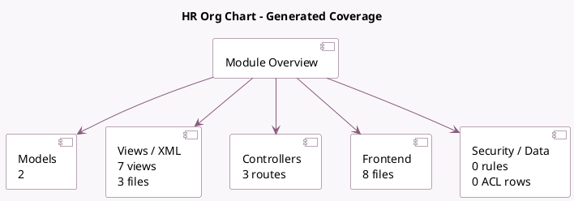

<!-- GENERATED:MODULE -->
---
tags: [odoo, community, module]
---

# HR Org Chart

- Scope: Community Addons
- Source: odoo/addons/hr_org_chart
- Dependencies: [[docs/Community Addons/hr/hr|hr]], [[docs/Community Addons/web_hierarchy/web_hierarchy|web_hierarchy]]

## Generated coverage

- Models: 2
- XML files with UI/data artifacts: 3
- Views: 7
- Actions: 6
- Menus: 0
- Rules (ir.rule): 0
- Access CSV entries: 0
- Controller units: 1
- Frontend asset files: 8

## Module map

## Detail notes

- Models: [[docs/Community Addons/hr_org_chart/Models|Models]] (2)
- Views and XML: [[docs/Community Addons/hr_org_chart/Views|Views]] (3 files)
- Controllers: [[docs/Community Addons/hr_org_chart/Controllers|Controllers]] (1)
- Frontend: [[docs/Community Addons/hr_org_chart/Frontend|Frontend]] (8 files)

## Key models

- `hr.employee`
- `hr.employee.public`

## Navigation

- [[../Community Addons/Community Addons|Back to scope]]
- [[../../docs/docs|Back to docs]]

<!-- GENERATED:MODULE -->

