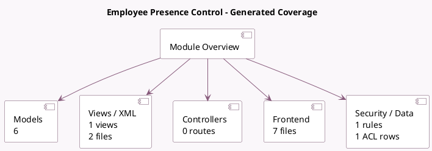

<!-- GENERATED:MODULE -->
---
tags: [odoo, community, module]
---

# Employee Presence Control

- Scope: Community Addons
- Source: odoo/addons/hr_presence
- Dependencies: [[docs/Community Addons/hr/hr|hr]], [[docs/Community Addons/hr_holidays/hr_holidays|hr_holidays]], [[docs/Community Addons/sms/sms|sms]]

## Generated coverage

- Models: 6
- XML files with UI/data artifacts: 2
- Views: 1
- Actions: 5
- Menus: 0
- Rules (ir.rule): 1
- Access CSV entries: 1
- Controller units: 0
- Frontend asset files: 7

## Module map

## Detail notes

- Models: [[docs/Community Addons/hr_presence/Models|Models]] (6)
- Views and XML: [[docs/Community Addons/hr_presence/Views|Views]] (2 files)
- Frontend: [[docs/Community Addons/hr_presence/Frontend|Frontend]] (7 files)

## Key models

- `hr.employee`
- `hr.employee.public`
- `ir.websocket`
- `res.company`
- `res.config.settings`
- `res.users.log`

## Navigation

- [[../Community Addons/Community Addons|Back to scope]]
- [[../../docs/docs|Back to docs]]

<!-- GENERATED:MODULE -->

